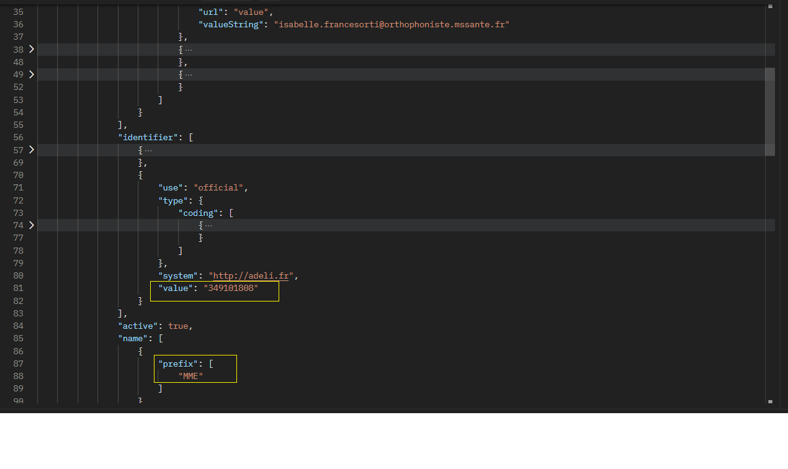
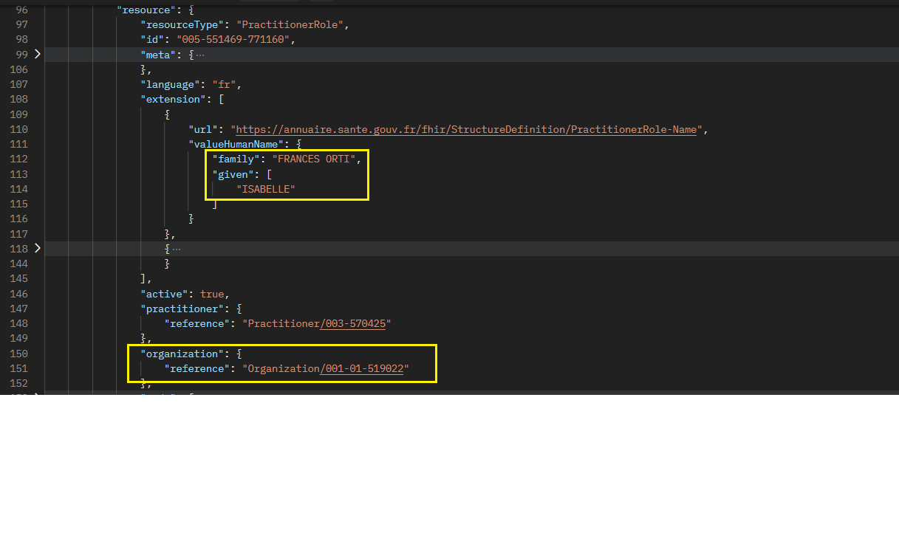
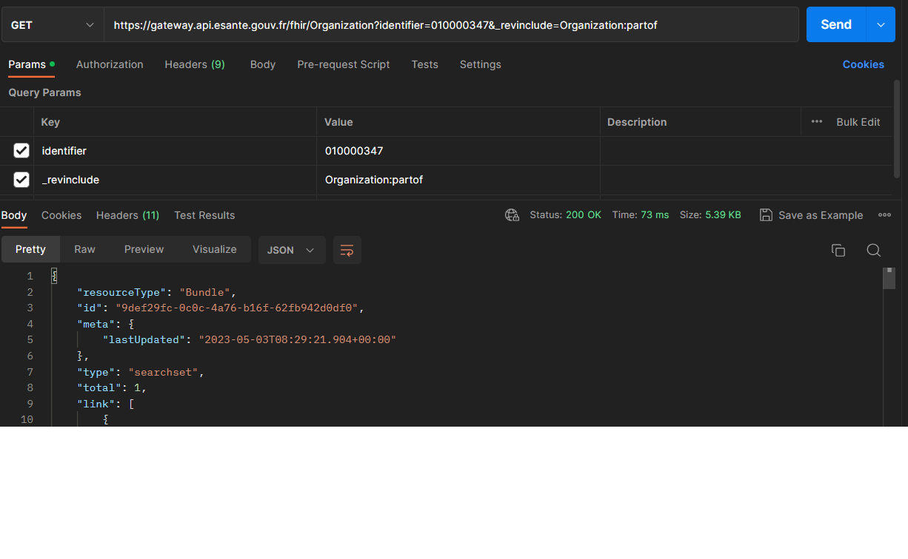
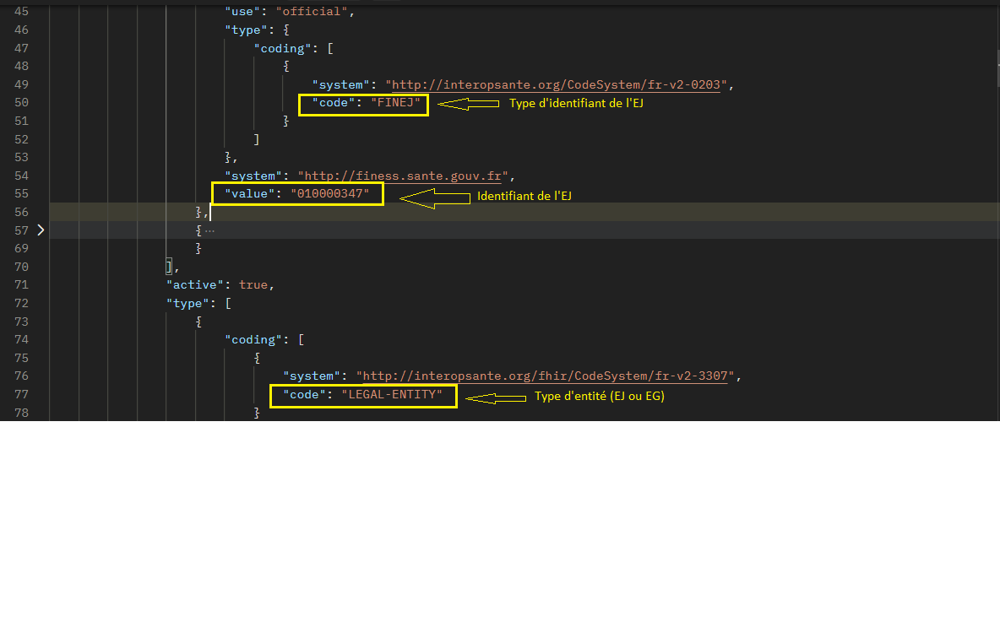

Voici des exemples de requêtes permettant de récupérer plusieurs ressources liées en un seul appel.
Il est par exemple possible de récupérer les ressources "HealthcareServices" liées à une ressource "PractitionerRole".


## Trouver l'Organization et le Practitioner d'un PractitionerRole
Le but ici étant de récupérer les ressources "Organization" et "Practitioner" liées à un PractitionerRole.

Pour cela, nous devons utiliser l'inclusion ("include").

<div class="code-sample">
<div class="tab-content" data-name="curl">

curl -H "ESANTE-API-KEY: {{site.ans.demo_key }}" "{{site.ans.api_url}}/fhir/PractitionerRole?_include=PractitionerRole%3Apractitioner&_include=PractitionerRole%3Aorganization&_count=10"

</div>
<div class="tab-content" data-name="java">

var client = createClient();

// The practitioner role know the practitioner and the organization, so the main request is on PractitionerRole and then we ask
// the server to include related Organization and Practitioner:

var bundleWithAllResources = (Bundle) client.search().forResource(PractitionerRole.class)
    // inclusion:
    .include(PractitionerRole.INCLUDE_PRACTITIONER.asNonRecursive())
    .include(PractitionerRole.INCLUDE_ORGANIZATION.asNonRecursive())
    .count(10)
    .execute();

</div>
<div class="tab-content" data-name="PHP">

$response = $client->request('GET', '/fhir/v1/PractitionerRole?_include=PractitionerRole:practitioner&_include=PractitionerRole:organization');
/** @var  $devices  \DCarbone\PHPFHIRGenerated\R4\FHIRResource\FHIRBundle*/
$practitionerRoles = $parser->parse((string) $response->getBody());

</div>

</div>

La méthode ```.count()``` permet de spécifier le nombre d'entrées maximum à récupérer.
Attention, la donnée retourner peut comporter plus que 10 items car les données liées sont retournées à plat dans cette même liste de données.

Il convient donc ensuite de tester le type de donnée afin de pouvoir l'interpréter :

<div class="code-sample">
<div class="tab-content" data-name="java">

// the bundle contains the page of PractitionerRole elements and additional elements for related Organization and Practitioner:
for(var entry : bundleWithAllResources.getEntry()){
    switch (entry.getResource().fhirType()) {
        case "PractitionerRole":
            // TODO treatment
            break;
        case "Practitioner":
            // TODO treatment
            break;
        case "Organization":
            // TODO treatment
            break;
        default:
            // TODO treatment
            break;
    }
}

// if you want to know which Practitioner/Organization is corresponding to a PractitionerRole you can do it with practitioner/organization field in the PractitionerRole resource:
var practitionerRoles = bundleWithAllResources.getEntry().stream().map(Bundle.BundleEntryComponent::getResource).filter(e -> "PractitionerRole".equals(e.fhirType())).map(PractitionerRole.class::cast).collect(Collectors.toList());
var practitioners = bundleWithAllResources.getEntry().stream().map(Bundle.BundleEntryComponent::getResource).filter(e -> "Practitioner".equals(e.fhirType())).map(Practitioner.class::cast).collect(Collectors.toList());
var organizations = bundleWithAllResources.getEntry().stream().map(Bundle.BundleEntryComponent::getResource).filter(e -> "Organization".equals(e.fhirType())).map(Organization.class::cast).collect(Collectors.toList());

</div>


<div class="tab-content" data-name="PHP">

foreach($practitionerRoles->getEntry() as $entry){
    /** @var  $oneResource  \DCarbone\PHPFHIRGenerated\R4\PHPFHIRContainedTypeInterface */
    $oneResource = $entry->getResource();
    switch ($oneResource->_getFHIRTypeName()):
        case 'PractitionerRole':
            // TODO treatment
            /** @var  $oneResource  \DCarbone\PHPFHIRGenerated\R4\FHIRResource\FHIRDomainResource\FHIRPractitionerRole */
            echo $oneResource->getId();
            break;
        case 'Practitioner':
            // TODO treatment
            /** @var  $oneResource  \DCarbone\PHPFHIRGenerated\R4\FHIRResource\FHIRDomainResource\FHIRPractitioner */
            echo $oneResource->getId();
            break;
        case 'Organization':
            // TODO treatment
            /** @var  $oneResource  \DCarbone\PHPFHIRGenerated\R4\FHIRResource\FHIRDomainResource\FHIROrganization */
            echo $oneResource->getId();
            break;
        default:
            // TODO treatment
            break;
    endswitch;
}

</div>
</div>
<br>
## Trouver le nom, le prénom, la civilité, l'adresse postale et les adresses MSS d'un Practitioner en partant de son identifiant ADELI/RPPS
1) Le nom, le prénom, la civilité et les adresses MSS sont récupérables en une seule requête qui retournera plusieurs objets. 
D'une part le Practitioner sur lequel nous allons pouvoir récupérer le numéro adeli/rpps ainsi que le genre et les mailboxmss. 
D'autre part, la liste des PractitionerRole (activités) qui contiendront elles : les noms, les prénoms d'exercice du professionel de santé pour l'activité.
<div class="code-sample">
<div class="tab-content" data-name="curl">

curl -H "ESANTE-API-KEY: {{site.ans.demo_key }}" "{{site.ans.api_url}}/fhir/Practitioner?identifier=349101808&_revinclude=PractitionerRole%3Apractitioner"

</div>
<div class="tab-content" data-name="postman">
  
</div>
</div>
<br/>
Le résultat retourné est un Bundle contenant le Practitioner et le PractitionerRole.
<br/>
<div class="wysiwyg" markdown="1">
 * Schéma montrant les données identifier, prefix et mailbox: 
  
</div>
<div class="wysiwyg" markdown="1">
 * Schéma montrant les données family name, given name et reference:Oganization 
  
</div>
<br>

2) Pour récupérer l'adresse postale, il faut faire une requête complémentaire sur Organization (les adresses étant celles des structures dans lesquelles le professionnel exerce ses activtés). 

Dans la réponse de la première requête 1), on retrouve le lien vers la structure d'exercice  :  <"reference": "Organization/001-01-519022">. Cela permet de faire une requête vers l'endpoint Organization afin de récupérer la structure liée à cette activité. 

<div class="code-sample">
<div class="tab-content" data-name="curl">

curl -H "ESANTE-API-KEY: {{site.ans.demo_key }}" "{{site.ans.api_url}}/fhir/Organization?_id=001-01-519022"

</div>
<div class="tab-content" data-name="postman">
  
</div>
</div>
<br/>
Le résultat retourné est un Bundle contenant l'Organization.
<br/>
<div class="wysiwyg" markdown="1">
 * Schéma montrant l'adresse postale: 
  
</div>
<br>

## Trouver l'ensemble des EG d'un EJ
Le but ici est de remonter l'entité juridique (Ressource Organization) ainsi que les entités géographiques qui lui sont rattachées (Ressource Organization)
en partant de l'identifiant EJ.

Pour ce faire, il faut interroger l'endpoint Organization avec le paramètre ["_revinclude"](https://build.fhir.org/search.html#_include) permettant d’inclure dans le résultat les ressources filles liées à la ressource mère.

<div class="code-sample">
<div class="tab-content" data-name="curl">

curl -H "ESANTE-API-KEY: {{site.ans.demo_key }}" "{{site.ans.api_url}}/fhir/Organization?identifier=010000347&_revinclude=Organization%3Apartof"

</div>
<div class="tab-content" data-name="postman">
  
</div>
</div>
<br/>
Le résultat retourné est un Bundle contenant l'EJ et les EG rattachées.
<br/>
<div class="wysiwyg" markdown="1">
 * Schéma montrant l'EJ (identifier:010000347) : 
  
</div>
<div class="wysiwyg" markdown="1">
 * Schéma montrant l'EG (identifier:010780914) rattachée à l'EJ (identifier:010000347): 
  
</div>
