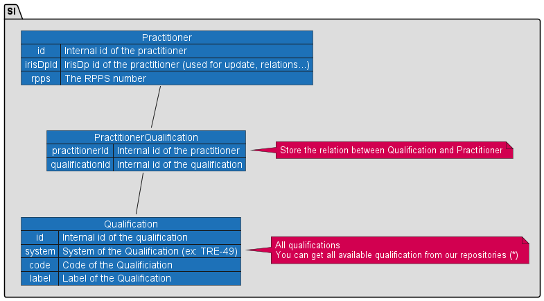

<!-- 

Cette documentation concerne la version 1 de l'API qui sera prochainement décommissionnée. Nous vous invitons à migrer vers la version 2 de l'API FHIR Annuaire Santé.

 -->

- [Stockage Fhir to Fhir](#one-header)
- [Stockage Fhir to Sql](#two-header)
- [Stockage hybride](#three-header)

 

Cette section vise à donner des pistes sur le stockage des données de l'API. Il s'agit de guides non exhaustifs donnés à titre d'exemple. 
Beaucoup d'autres techniques existent.

## 1) Fhir to Fhir

Dans le mode de stockage Fhir to Fhir, vous stockez la donnée telle que vous la recevez au format FHIR. 

Comme le format est du json (ou xml), vous devrez utiliser un système qui supporte le stockage de ce format de données comme par exemple mongodb, elasticsearch...
Il est aussi tout à fait possible d'utiliser un serveur FHIR du marché.

C'est un bon choix si vous souhaitez avoir un référentiel "on premise" rapidement.  

**Avantages :** 

* Relativement rapide/simple à mettre en place
  * Le schéma existe déjà
  * Vous n'avez pas de traitement particulier pour stocker la donnée
* Performances 
  * Pas de relations à gérer

**Inconvénients :**

* Contrôle d'intégrité 
  * Le stockage en objet json nécessite en général une surcouche logicielle pour gérer l'intégrité
* Donnée dénormalisée
  * Le format fhir est de base dénormalisé notamment sur les objets profonds

&nbsp;

## 2) Fhir to Sql

Dans le mode de stockage Fhir to Sql, vous allez convertir les données fhir en un schéma relationnel. 

Comme les données Fhir sont profondes et proposent des cardinalités complexes, 
vous allez avoir plusieurs tables relationnelles pour une seule ressource FHIR. 

Représenter le format FHIR en un schéma relationnel est complexe et va entrainer de nombreuses relations.

**Si vos besoins ne nécessitent pas d'avoir un schéma relationnel fhir, il est alors préférable de créer un schéma propre à vos besoins.**

NOTE | Certaines implémentations sont basées sur le pattern [EAV](https://en.wikipedia.org/wiki/Entity%E2%80%93attribute%E2%80%93value_model) dont nous ne parlerons pas ici. 

Imaginons par exemple que vous ne souhaitiez récupérer que les id RPPS des Practitioner ainsi que leurs qualifications, vous pourriez avoir un schéma de type: 

(*) Référentiels pour les Qualifications : [TRE-R14](https://mos.esante.gouv.fr/NOS/TRE_R14-TypeDiplome/FHIR/TRE-R14-TypeDiplome), [TRE-R48](https://mos.esante.gouv.fr/NOS/TRE_R48-DiplomeEtatFrancais/FHIR/TRE-R48-DiplomeEtatFrancais),[TRE-R49](https://mos.esante.gouv.fr/NOS/TRE_R49-DiplomeEtudeSpecialisee/FHIR/TRE-R49-DiplomeEtudeSpecialisee),
,[TRE-R50](https://mos.esante.gouv.fr/NOS/TRE_R50-DESCGroupe1Diplome/FHIR/TRE-R50-DESCGroupe1Diplome)
,[TRE-R51](https://mos.esante.gouv.fr/NOS/TRE_R51-DESCGroupe2Diplome/FHIR/TRE-R51-DESCGroupe2Diplome)
,[TRE-R52](https://mos.esante.gouv.fr/NOS/TRE_R52-CapaciteDiplome/FHIR/TRE-R52-CapaciteDiplome)
,[TRE-R53](https://mos.esante.gouv.fr/NOS/TRE_R53-DiplomePaysEEE/FHIR/TRE-R53-DiplomePaysEEE)
,[TRE-R54](https://mos.esante.gouv.fr/NOS/TRE_R54-DiplomeUniversiteInterUniversitaire/FHIR/TRE-R54-DiplomeUniversiteInterUniversitaire)
,[TRE-R55](https://mos.esante.gouv.fr/NOS/TRE_R55-CertificatEtudeSpeciale/FHIR/TRE-R55-CertificatEtudeSpeciale)
,[TRE-R56](https://mos.esante.gouv.fr/NOS/TRE_R56-Attestation/FHIR/TRE-R56-Attestation)
,[TRE-R57](https://mos.esante.gouv.fr/NOS/TRE_R57-DiplomeEuropeenEtudeSpecialisee/FHIR/TRE-R57-DiplomeEuropeenEtudeSpecialisee)
,[TRE-R58](https://mos.esante.gouv.fr/NOS/TRE_R58-AutreTypeDiplome/FHIR/TRE-R58-AutreTypeDiplome)
,[TRE-R36](https://mos.esante.gouv.fr/NOS/TRE_R36-AutreDiplomeObtenu/FHIR/TRE-R36-AutreDiplomeObtenu)
,[TRE-R47](https://mos.esante.gouv.fr/NOS/TRE_R47-CommissionQualification/FHIR/TRE-R47-CommissionQualification)
,[TRE-R226](https://mos.esante.gouv.fr/NOS/TRE_R226-Dip2iemeCycleNQ/FHIR/TRE-R226-Dip2iemeCycleNQ)

## 2) Hybride

Il est tout à fait possible de stocker les données dans un format mixte : Sql + Fhir brute. Par exemple, vous pouvez stocker quelques données utiles pour votre système dans une base de données relationnelle (intégrité, indexes...) et avoir une colonne spécifique qui stocke les données Fhir au format JSON/XML. 

