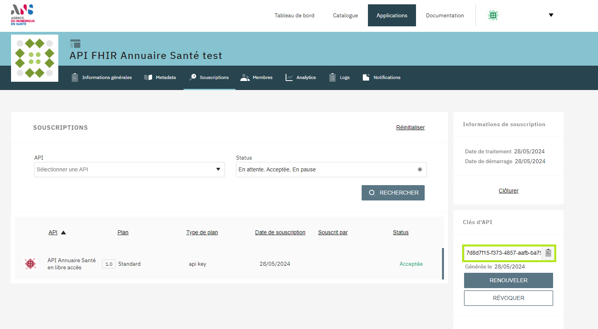

<div class="wysiwyg" markdown="1">
- [Démarrer les tests API avec Postman](#one-header)
- [Démarrer les tests API avec cURL](#two-header)
- [Liens d'accès](#three-header)
</div>
<br />

## <a id="one-header"></a>1) Démarrer les tests API avec Postman


### Récupérer la collection Postman

Pour tester rapidement et facilement l'API FHIR Annuaire Santé, télécharger cette collection Postman contenant des exemples d'appels FHIR.

[](https://app.getpostman.com/run-collection/8078261-a496d05a-e735-4211-9844-31b45ba5e6dd?action=collection%2Ffork&collection-url=entityId%3D8078261-a496d05a-e735-4211-9844-31b45ba5e6dd%26entityType%3Dcollection%26workspaceId%3D0376a555-c1a8-4912-9cb4-4945375d85e8#?env%5BProd%5D=W3sia2V5IjoiYXBpX2tleSIsInZhbHVlIjoiWFhYWC1YWFhYLVhYWFgtWFhYWCIsImVuYWJsZWQiOnRydWUsInR5cGUiOiJkZWZhdWx0Iiwic2Vzc2lvblZhbHVlIjoiWFhYWC1YWFhYLVhYWFgtWFhYWCIsInNlc3Npb25JbmRleCI6MH0seyJrZXkiOiJhcGlfdXJsIiwidmFsdWUiOiJodHRwczovL2dhdGV3YXkuYXBpLmVzYW50ZS5nb3V2LmZyL2ZoaXIiLCJlbmFibGVkIjp0cnVlLCJ0eXBlIjoiZGVmYXVsdCIsInNlc3Npb25WYWx1ZSI6Imh0dHBzOi8vZ2F0ZXdheS5hcGkuZXNhbnRlLmdvdXYuZnIvZmhpciIsInNlc3Npb25JbmRleCI6MX1d)


### Configuration de la clé d'API

Une fois le projet importé dans votre espace Postman:
- dans le menu "Environnements": créer un environnement "Prod" et renseigner les variables nécessaires (ex: api_key et api_url)
- dans le menu "Collection": choisir un dossier et lancer un appel 
- attention: vérifier bien que les variables d'environnements sont bien sélectionnées (situé en haut à droite de l'écran)

Veuillez trouver ci-dessous les variables utilisées dans le projet Postman: 

|Variable|Description|Valeur|
|---|---|---|
|api_key|Clé d'API (Si vous n'avez pas de clé, veuillez suivre la procédure décrite [ici](/annuaire-sante-fhir-documentation/pages/guide/version-1/getting-started/test-api.html))|Saisissez votre clé|
|api_url|L’url d’accès à l’API	|https://gateway.api.esante.gouv.fr/fhir|

<p align="center">
  
</p>

## <a id="two-header"></a>2) Démarrer les tests API avec cURL
NOTE| Pour la suite de l'exercice, vous devez remplacer {{site.ans.demo_key }} par votre clé d'API.

Pour ces premiers tests, nous utilisons cURL pour plus de simplicité. [cURL](https://curl.se/) étant un outil présent sur la plupart des plateformes windows 10+, macos, linux.

<div class="wysiwyg" markdown="1">
* **Test 1** : lancez la commande suivante pour récupérer le CapabilityStatement FHIR (liste des fonctionnalités de l'API) :
</div>
&nbsp;


<div class="code-sample"><div class="tab-content" data-name="bash">

curl -H "ESANTE-API-KEY: {{site.ans.demo_key }}" "{{site.ans.api_url}}/fhir/metadata?_pretty=true&_format=json"

</div></div>
<div class="wysiwyg" markdown="1">
* Ci-dessous la réponse de l'API : 
</div>
&nbsp;

```json
{
  "resourceType": "CapabilityStatement",
  "fhirVersion": "4.0.1",
  "format": [ "application/fhir+xml", "xml", "application/fhir+json", "json" ],
  "rest": [ {
    ...


```
&nbsp;

NOTE| Le capability statement permet de connaitre les fonctionnalités disponibles sur le serveur FHIR (paramètres, ressources...).

<div class="wysiwyg" markdown="1">
* <b>Test 2</b> : vous pouvez lancer cette requête pour récupérer les ressources "Practitioner" :
</div>
&nbsp;
<div class="code-sample"><div class="tab-content" data-name="bash">

curl -H "ESANTE-API-KEY: {{site.ans.demo_key }}" "{{site.ans.api_url}}/fhir/Practitioner?_pretty=true&_format=json"

</div></div>

<div class="wysiwyg" markdown="1">
* Ci-dessous un exemple de réponse :
</div>
&nbsp;

```json
{
  "resourceType": "Bundle",
  "entry": [ {
    "fullUrl": "https://.../fhir/v1/Practitioner/pra-59",
    "resource": {
      "resourceType": "Practitioner",
      "id": "pra-59",
    }
  }, {
    "fullUrl": "https://.../fhir/v1/Practitioner/pra-57",
    "resource": {
      "resourceType": "Practitioner",
      "id": "pra-57",
      ...
    }
  }
  ...
  ]
}


```

&nbsp;

## <a id="three-header"></a>3) Liens d'accès

| NOM | LIEN URL |
| --- | --- |
| Serveur d'accès au service | https://gateway.api.esante.gouv.fr/fhir |
| URL d'accès au Démonstrateur API | https://portail.openfhir.annuaire.sante.fr |

<p align="center">
  
</p>
