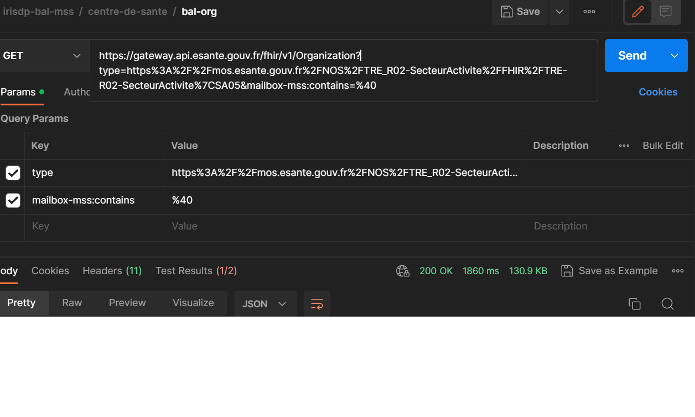
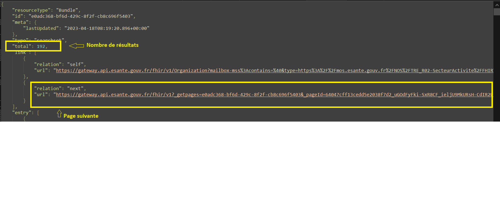
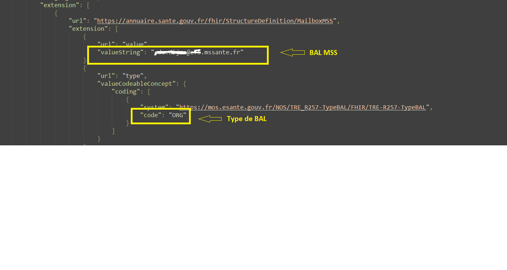
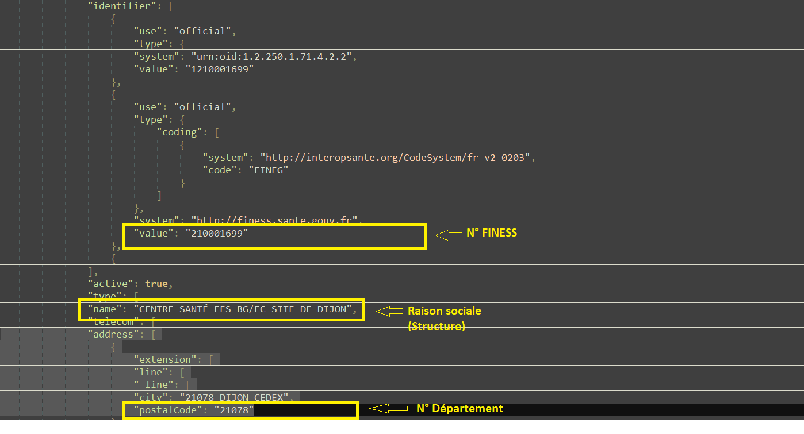
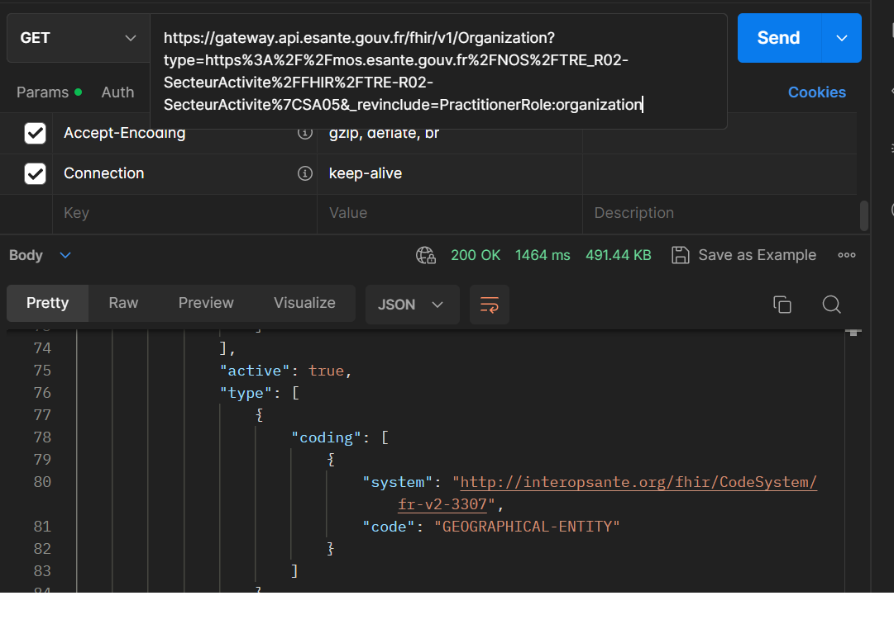
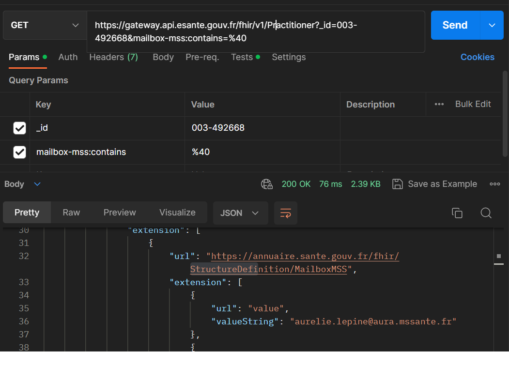
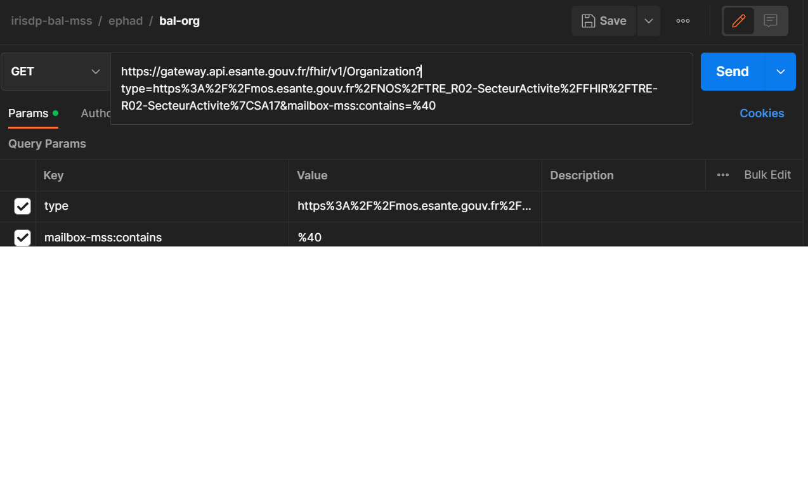

 <!-- 

Cette documentation concerne la version 1 de l'API qui sera prochainement décommissionnée. Nous vous invitons à migrer vers la version 2 de l'API FHIR Annuaire Santé.

 -->

Cette partie de la spécification est en cours de construction.

- [Rechercher les BAL des centres de santé](#cs-header)
- [Rechercher les BAL des laboratoires](#lab-header)
- [Rechercher les BAL des officines](#ph-header)
- [Rechercher les BAL des EPHAD](#ep-header)

 

L’ANS, en tant que régulateur de l’espace national de confiance MSSanté, tient à jour l’annuaire national MSSanté, qui rassemble toutes les BAL (boîtes aux lettres) transmises par les opérateurs de l’espace de confiance.
L’opérateur transmet, pour chaque BAL du périmètre cité, un identifiant national de personne (RPPS ou ADELI) et/ou un identifiant de structure (FINESS pour les BAL rattachées à un établissement de santé).

Il existe plusieurs types de BAL :

* les BAL (boîtes aux lettres) « personnelles » des personnes physiques disposant d’un identifiant RPPS ou d’un identifiant ADELI, dont l’usage est sous la responsabilité exclusive du porteur de l’adresse ;
* les BAL « personnelles » non rattachées à un identifiant national ; ces BAL sont attribuées à des personnes dont l’identité est enregistrée par une personne morale (établissement de santé…) responsable de l’accès et de l’usage de la BAL ;
* les BAL « organisationnelles » associées à un service ou à une équipe, rattachées à une personne morale responsable de l’accès et de l’usage de la BAL ;
* les BAL « applicatives » associées à un logiciel métier ou à une machine et utilisées à des fins d’envois ou de réception automatisés, rattachées à une personne morale responsable de l’accès et de l’usage de la BAL.

&nbsp;

NOTE | Pour plus d'informations sur la MSSanté, [cliquez ici](https://mailiz.mssante.fr/home). 

 

## Cas d'utilisation 
En tant que client de l'API, je souhaite rechercher l'ensemble des boîtes aux lettres de messagerie sécurisée d'un type de structure.

## 1) Centres de santé (type=SA25)

#### 1.1) Les BAL organisationnelles
Afin d'extraire les BAL MSSanté organisationnelles , il faut interroger l’endpoint Organization.

Nous appliquerons deux filtres à la requête afin d’obtenir le résultat attendu :

 * le type d'Organization : SA5 (ici, le type correspond  au secteur d'activité SA05 => Centre de santé) 
 * Et en n'incluant que les Organization ayant au moins d'une BAL MSS

 

 
Faire un appel sur l'endpoint Organization en filtrant sur les Organizations :
  * de type SA05 (type=https%3A%2F%2Fmos.esante.gouv.fr%2FNOS%2FTRE_R02-SecteurActivite%2FFHIR%2FTRE-R02-SecteurActivite)
  * et ayant au moins un mailbox (mailbox-mss:contains=%40 )
 

 
curl -H "ESANTE-API-KEY: {{site.ans.api_key }}" "{{site.ans.api_url}}/fhir/v1/Organization?type=https%3A%2F%2Fmos.esante.gouv.fr%2FNOS%2FTRE_R02-SecteurActivite%2FFHIR%2FTRE-R02-SecteurActivite%7CSA05&mailbox-mss:contains=%40" 


  
  

 
 

Le résultat retourné est un Bundle contenant la première page de résultat. Il contient aussi le nombre total d'éléments retournés par la requête pouvant être récupérés sur les pages suivantes.
 
L’exécution de l’exemple de code peut donner un résultat équivalent :
 

 * Schéma montrant les champs total et next : 

 * Schéma montrant les champs mailbox et son type : 

 * Schéma montrant les champs n°finess, raison sociale et département : 

 
 
#### 1.2) Les BAL personnelles
Afin d'extraire les BAL MSSanté personnelles des professionnels ayant une activité dans une de ces structures , il faut interroger l’endpoint Organization.

 * En filtrant sur le type d’établissement : SA05
 * En incluant les PractitionerRole liés aux Organizations afin de pouvoir interroger ensuite l'endpoint Practitioner pour récupérer les BAL MSS

 

 
1) Faire un appel sur l'endpoint Organization en filtrant sur les Organization de type SA05 (&type=SA05). Cet appel devra inclure les PractitionerRoles rattachés (&_revinclude=PractitionerRole:organization)
2) Pour chacun des PractitionerRole récupérés précédemment, récupérer le Practitioner ayant le même id que le champs practitioner du PractitionerRole (Practitioner?_id=003-xxxxxx)
3) Pour chacun des Practitioner récupérés, vérifier qu'il dispose bien de bal mss (mailbox-mss:contains=%40)
4) Répéter l'opération sur toutes les pages (1)


 
curl -H "ESANTE-API-KEY: {{site.ans.api_key }}" "{{site.ans.api_url}}/fhir/v1/Organization?type=https%3A%2F%2Fmos.esante.gouv.fr%2FNOS%2FTRE_R02-SecteurActivite%2FFHIR%2FTRE-R02-SecteurActivite%7CSA05&_revinclude=PractitionerRole:organization" 

 

  
  

 

L’exécution de l’exemple de code peut donner un résultat équivalent :
 

 * Schéma montrant le champs practitioner du PractitionerRole : 

 * Schéma montrant les champs BAL MSS, Type de BAL et Identifiant personne : 

 

## 2) Laboratoires
Le process d'extraction des BAL est similaire à celui appliqué précédemment pour les centres de santé.

Afin de récupérer les établissements de biologie , nous devons interroger l’endpoint Organization :

* En filtrant sur le système et les types d’établissements : https://mos.esante.gouv.fr/NOS/TRE_R02-SecteurActivite/FHIR/TRE-R02-SecteurActivite, SA25, SA29

 
Faire un appel sur l'endpoint Organization en filtrant sur les Organizations :
  * de type SA25, SA29
  * et ayant au moins un mailbox 
 

 
curl -H "ESANTE-API-KEY: {{site.ans.api_key }}" "{{site.ans.api_url}}/fhir/v1/Organization?type=https%3A%2F%2Fmos.esante.gouv.fr%2FNOS%2FTRE_R02-SecteurActivite%2FFHIR%2FTRE-R02-SecteurActivite%7CSA25%2Chttps%3A%2F%2Fmos.esante.gouv.fr%2FNOS%2FTRE_R02-SecteurActivite%2FFHIR%2FTRE-R02-SecteurActivite%7CSA29&mailbox-mss:contains=%40" 


  

## 3) Officines
Le process d'extraction des BAL est similaire à celui appliqué précédemment pour les centres de santé.

Afin de récupérer les officines de pharmacie, nous devons interroger l’endpoint Organization :

* En filtrant sur le système et les types d’établissements : https://mos.esante.gouv.fr/NOS/TRE_R02-SecteurActivite/FHIR/TRE-R02-SecteurActivite, SA33, SA38, SA39

 
Faire un appel sur l'endpoint Organization en filtrant sur les Organizations :
  * de type SA33, SA38, SA39 
  * et ayant au moins un mailbox 
 

 
curl -H "ESANTE-API-KEY: {{site.ans.api_key }}" "{{site.ans.api_url}}/fhir/v1/Organizationt?ype=https%3A%2F%2Fmos.esante.gouv.fr%2FNOS%2FTRE_R02-SecteurActivite%2FFHIR%2FTRE-R02-SecteurActivite%7CSA33%2Chttps%3A%2F%2Fmos.esante.gouv.fr%2FNOS%2FTRE_R02-SecteurActivite%2FFHIR%2FTRE-R02-SecteurActivite%7CSA38%2Chttps%3A%2F%2Fmos.esante.gouv.fr%2FNOS%2FTRE_R02-SecteurActivite%2FFHIR%2FTRE-R02-SecteurActivite%7CSA39&mailbox-mss:contains=%40" 


  

## 4) EPHAD

#### 4.1) Liste des EPHAD
Afin de récupérer la liste des EPHAD, nous devons interroger l’endpoint Organization :

* En filtrant sur le système et le type d’établissement : https://mos.esante.gouv.fr/NOS/TRE_R02-SecteurActivite/FHIR/TRE-R02-SecteurActivite, SA17
* En incluant les entités juridiques de rattachement : Organization.partof

 
Faire un appel sur l'endpoint Organization en filtrant sur les Organizations dont le secteur d'activité est SA17.  Cet appel devra inclure les établissements pères dits juridiques auxquels sont rattachés les établissements géographiques (&_include=Organization:partof):


 
curl -H "ESANTE-API-KEY: {{site.ans.api_key }}" "{{site.ans.api_url}}/fhir/v1/Organizationt?type=https%3A%2F%2Fmos.esante.gouv.fr%2FNOS%2FTRE_R02-SecteurActivite%2FFHIR%2FTRE-R02-SecteurActivite%7CSA17&_include=Organization:partof" 


L’exécution de l’exemple de code peut donner un résultat équivalent :
 

 * Schéma montrant les champs FINESS EG et Type d'établissement (géographique ou juridique) : 

 

 * Schéma montrant les champs Raison sociale, Code postal (département/région) et Id technique de l'entité juridique de rattachement : 

 

 * Schéma montrant les champs Organization.partof (lien vers l'entité juridique) et FINESS EJ : 

 

#### 4.2) Liste des BAL rattachées
##### 4.2.1) BAL ORG
 Afin d'extraire les BAL MSSanté organisationnelles , il faut interroger l’endpoint Organization.

Nous appliquerons deux filtres à la requête afin d’obtenir le résultat attendu :

 * le type d'Organization : SA17 (secteur d'activité) 
 * Et en n'incluant que les Organizations ayant au moins d'une BAL MSS

 

 
Faire un appel sur l'endpoint Organization en filtrant sur les Organizations :
  * de type SA17 (type=https%3A%2F%2Fmos.esante.gouv.fr%2FNOS%2FTRE_R02-SecteurActivite%2FFHIR%2FTRE-R02-SecteurActivite)
  * et ayant au moins un mailbox (mailbox-mss:contains=%40 )
 

 
curl -H "ESANTE-API-KEY: {{site.ans.api_key }}" "{{site.ans.api_url}}/fhir/v1/Organization?type=https%3A%2F%2Fmos.esante.gouv.fr%2FNOS%2FTRE_R02-SecteurActivite%2FFHIR%2FTRE-R02-SecteurActivite%7CSA17&mailbox-mss:contains=%40" 


  
  

