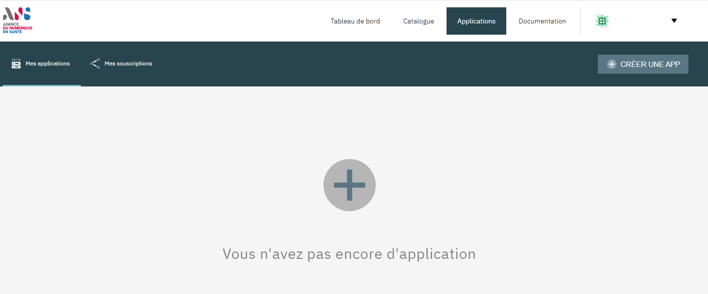
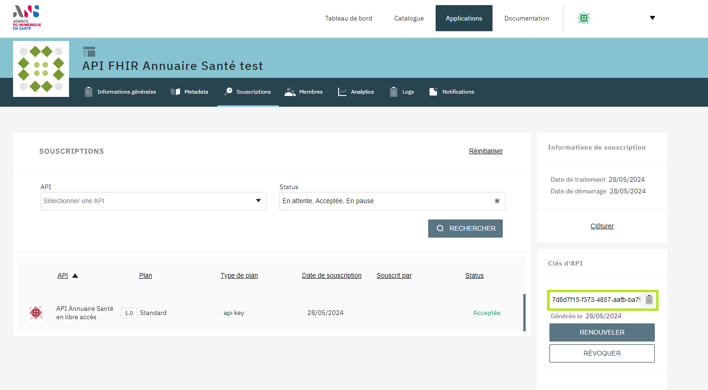

- [Création d'un compte dans Gravitee](#one-header)
- [Création d'une application dans Gravitee](#two-header)
- [Aller plus loin](#three-header)

 

Ce guide explique comment obtenir une clé d'API et la configurer pour effectuer votre premier appel à l'API.

## 1) Création d'un compte dans Gravitee
Pour appeler l'API, il est nécessaire de disposer d'une clé d'API. Pour obtenir cette clé, vous devez vous rendre sur l’outil de gestion d’API de l'ANS : [GRAVITEE](https://portal.api.esante.gouv.fr/catalog/api/962f412b-e08e-4ee7-af41-2be08eeee7f6){:target="_blank"}.
La création d'un compte est obligatoire pour accéder à l'outil GRAVITEE.

| ETAPES | DESCRIPTION |
| --- | --- |
| 1 | Créer votre compte sur l'API manager de l'ANS: [GRAVITEE](https://portal.api.esante.gouv.fr){:target="_blank"} |
| 2 | Saisir votre prénom, votre nom et une adresse email pour valider l'enregistrement |
| 3 | À l'issue de la création de votre compte, un email de confirmation est envoyé à l'adresse email renseignée. Cet email contient un lien permettant de terminer le processus de validation du compte |

## 2) Création d'une application dans Gravitee
Une fois la création du compte réalisée, l'étape suivante consiste à créer une application dans GRAVITEE afin d'obtenir une clé API.

  

Pour créer une application, les étapes à réaliser sont :

| ETAPES | DESCRIPTION |
| --- | --- |
| 1 | Dans l'onglet "Applications", cliquer sur "CREER UNE APP" |
| 2 | Renseigner le nom de l'application, une description, le domaine utilisé par l'application et une image. Le domaine de l'application n'est pas vérifié techniquement, même s'il doit être spécifié lors de l'enregistrement de l'application sur Gravitee. |
| 3 | Saisir le type (web, mobile, etc.) et le client_ID (facultatif) |
| 4 | Chercher l'API suivante: API Annuaire Santé en libre accès et cliquer sur "Souscrire" et "Suivant" |
| 5 | Cliquer sur "Créer l'application" pour terminer |

Dans le menu "Application" dans l'onglet "Souscriptions", vous pourrez retrouver toutes les API souscrites. En cliquant dans le tableau sur l'une des API, la clé API à utiliser s'affiche. 

  

* Utiliser l'API KEY "**ESANTE-API-KEY**" et le jeton récupéré par GRAVITEE.
* Effectuer des requêtes API en utilisant le démonstrateur API ou en utilisant des logiciels gratuits (ex: Postman) 

&nbsp;

NOTE| Actuellement, il n'existe aucune limitation en termes d'applications enregistrées sur l'application Gravitee (aucune restriction sur le débit, le nombre de souscriptions, le nombre d'appels ou de quotas). Nous déterminerons ces limitations après le décommissionnement de l'API FHIR Annuaire Santé V1.

##  Aller plus loin

#### Ressources internes 

* Démarrage par langage: [JAVA]({{ '/pages/guide/version-2/integration-fhir/integration-java.html' | relative_url }}), [C#]({{ '/pages/guide/version-2/integration-fhir/integration-dotnet.html' | relative_url }})
* [Accéder aux ressources]({{ '/pages/hub' | relative_url }})
* [Cas d'utilisation de synchronisation]({{ '/pages/use-cases/full/uc-full' | relative_url }})
* [Cas d'utilisation d'appels unitaires]({{ '/pages/use-cases/practitioner-detail/uc-practitioner' | relative_url }})

&nbsp;

#### Ressources externes

* [Site officiel de FHIR](https://www.hl7.org/fhir/){:target="_blank"}
* [Librairie HAPI FHIR](https://hapifhir.io/){:target="_blank"}
* [Guide d'implémentation FHIR - Annuaire Santé](https://interop.esante.gouv.fr/ig/fhir/annuaire){:target="_blank"}

