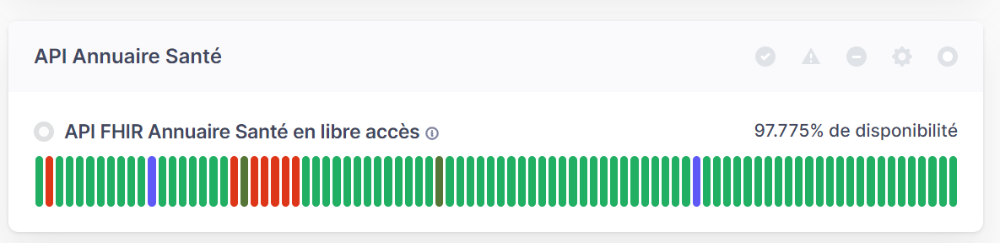

### Introduction

La documentation de l'API FHIR Annuaire Santé est une ressource essentielle pour les développeurs et professionnels de santé souhaitant intégrer des fonctionnalités de recherche de professionnels et de structures de santé dans leurs systèmes d'information. Elle propose des guides pratiques, des exemples de cas d'utilisation, et des démonstrations pour faciliter la prise en main de cette API RESTFUL.

### Modèle de données FHIR

L'API FHIR Annuaire Santé utilise la norme FHIR dans sa version R4 et suit scrupuleusement le guide d'implémentation FHIR (Fast Healthcare Interoperability Resources). LE FHIR est une norme pour l'échange de données de santé, publiée par HL7.
Cette norme nous aide à être interopérable et à offrir des modèles de données de santé approuvés par l'écosystème santé.

### Ressources FHIR
Il existe aujourd'hui 5 ressources disponibles sur l'API FHIR Annuaire Santé:

| Ressources | Description |
| --- | --- |
| Practitioner | Contient les informations liées à l'exercice professionnel d'un Professionnel intervenant dans le système de Santé. Cela comprend le nom et prénom d'exercice, la catégorie professionnelle, la profession, les diplômes, le savoir-faire, etc. etc. |
| PractitionerRole |  Contient les informations liées à la situation d’exercice / activité d'un professionnel avec le genre d'activité, la fonction, le mode d'exercice, la section Tableau Pharmacien, le Practitioner rattachée, l'Organization rattachée, etc. |
| Organization | Décrit les organisations du domaine sanitaire, social et médico-social |
| HealthcareService | Décrit les équipements sociaux et activités de soins rattachées aux établisemments FINESS |
| Device | Décrit les Equipements Matériels Lourds (EML) mis en oeuvre au sein d’établissements. |

&nbsp;

### Météo des services de l'Annuaire Santé

Il est possible de consulter la page [Météo des services de l'Annuaire Santé](https://status.annuaire-sante.esante.gouv.fr/){:target="_blank"} afin de vérifier si l'API FHIR Annuaire Santé est opérationnelle ou non.
Il est également possible de s'abonner pour être notifié lorsque le statut de l'API FHIR Annuaire Santé est mis à jour (situé en bas de l'écran)

