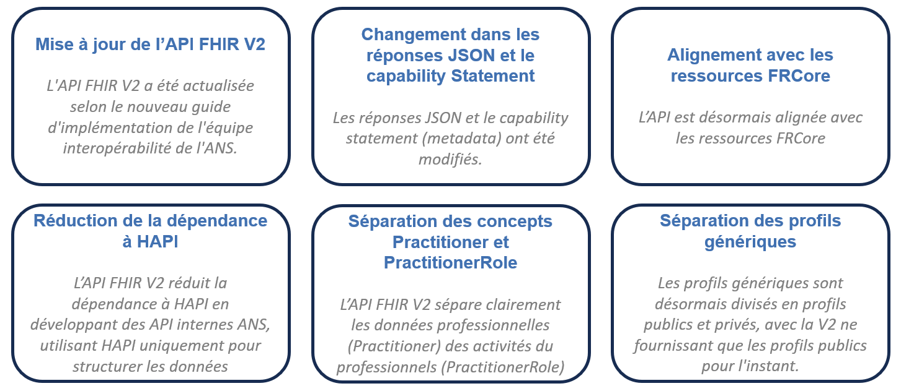

- [Un aperçu des changements sur l'API FHIR V2](#one-header)
- [Est-ce-que les 2 versions sont disponibles ?](#two-header)
- [Existe-il un risque sur la migration entre la V1 et la V2 ?](#three-header)
- [Les nouveautés sur chaque ressource](#four-header)

&nbsp;

## 1) Un aperçu des changements sur l'API FHIR V2

  

&nbsp;

## 2) Est-ce-que les 2 versions de l'API FHIR sont toujours disponibles?
Oui, vous pouvez appeler les deux versions de l'API FHIR. Une décommission de l'API FHIR V1 sera prévue pour Fin 2025/Début 2026. Pour plus d'explications sur la manière d'interroger les deux versions de l'API, consulter le [lien suivant pour l'API FHIR V1](https://ansforge.github.io/annuaire-sante-fhir-documentation/pages/guide/version-1/getting-started/test-api.html) ou le [lien suivant pour l'API FHIR V2](https://ansforge.github.io/annuaire-sante-fhir-documentation/pages/guide/version-2/getting-started/test-api.html).

A noter que:
- Le [démonstrateur API](https://portail.openfhir.annuaire.sante.fr/) utilisera par défaut la nouvelle version de l'API FHIR V2. 
- Lors des appels au service de l'API FHIR via cUrl, Postman, etc. (https://gateway.api.esante.gouv.fr/fhir), le service retournera une réponse via l'API FHIR V1. Ce choix a été fait pour éviter toute perturbation avec les consommateurs actuels. 

&nbsp;

## 3) Existe-il un risque sur la migration entre la V1 et la V2 ?
La migration entre l'API FHIR V1 et V2 est relativement simple. A noter que pour les consommateurs qui souhaitent utiliser l'API FHIR V2 :

- Les ID techniques seront identiques pour les 3 ressources suivantes: Organization, HealthcareService et Device
- A l'inverse, un changement est apporté sur les 2 ressources Practitioner et PractitionerRole entre la V1 et la V2 : la correspondance des ID techniques entre la V1 et la V2 sur ces 2 ressources ne seront pas identiques (suite à une modélisation trop différente dans le guide d’implémentation) 

&nbsp;

Nous avons pu aussi constater que certains consommateurs peuvent conserver les ID techniques dans leurs requêtes :

-	Si ces consommateurs stockent ces ID techniques, il peut y avoir ce risque entre la V1 et la V2. Il est recommandé d'utiliser les identifiants métiers (ex: identifier) sur les ressources. 
-	A noter qu’Il n'y avait pas d'identifiant métier sur le PractitionerRole dans l’API FHIR V1. Dans l’API FHIR V2, l’attribut identifier (identifiant métier) a été ajouté sur la ressource PractitionerRole.

&nbsp;

## 3) Les nouveautés sur chaque ressource

Quelles sont les nouveautés globalement sur cette nouvelle version :
- Revue sur le format de réponse du Capability Statement (metadata)
- Ajout de l'attribut : profile: fr-canonical
- Ajout de la source et profile dans le champ meta lorsqu'une ressource est désactivée
- Renommage de l'attribut publication par "listeRouge
- Amélioration de la recherche sur les différents champs : prénom d'exercice, nom d'exercice, adresse mail MSS, raison sociale, enseigne commerciale, etc.)
- Suppression de la ressource "Subscription"

Nous allons voir en détail les nouveautés au niveau de chaque ressource:
&nbsp;

### Nouveautés sur Practitioner

| Données       | Ressource Practitioner                                                         |   
| ---           | ---                                                                            |
| resource      | Ajout dans le profile le profile: fr-canonical                                 |
| identifier    | Ajout systématique de l'identifiant national (IDNPS)                           |
| name          | Ajout de l'attribut name contenant les données du professionnel (nom d'exercice, prénom, d'exercice, le préfix (ex:MME) et le suffixe (ex:DR).)|
| qualification | Ajout des informations sur la catégorie professionnelle, la profession, la fonction, les savoir-faire et les types de savoir-faire.   |
| telecom       | Ajout d'un attribut telecom contenant l'ensemble des informations MSSanté (Type de messagerie, Type de BAL, dématérialisation, etc.) |
| cps           | Ajout des informations liées aux cartes CPx du Professionnel                   |
| active        | Si la ressource est en statut false, les informations suivantes seront visibles: id de la ressource, identifiant du professionnel (Identifiant national, RPPS) et le champ active  |

### Nouveautés sur PractitionerRole

| Données        | Ressource PractitionerRole                                                           |    
| ---            | ---                                                                                  |
| identifier     | Ajout d'un attribut identifier au niveau du PractitionerRole. L'identifier est également un paramètre de recherche |
| reference      | Ajout de la référence à l'Organization                                               |
| code           | Suppression des attributs catégorie professionnelle et Profession (déplacés dans Practitioner) |
| cps            | Suppression des informations liées aux cartes CPx du Professionnel                   |
| telecom       | Ajout d'un attribut telecom contenant l'ensemble des informations MSSanté (Type de messagerie, Type de BAL, dématérialisation, etc.) |
| valueHumanName | Suppression des informations liées à l'exercice professionnel du Practitioner (déplacés dans Practitioner sous l'attribut Name)  |
| specialty      | Suppression des informations liées aux savoir-faire et aux types de savoir-faire     |

### Nouveautés sur Organization

| Données        | Ressource Organization                                                               |    
| ---            | ---                                                                                  |
| reference      | Ajout de la référence à l'Organization                                               |
| telecom       | Ajout d'un attribut telecom contenant l'ensemble des informations MSSanté (Type de messagerie, Type de BAL, dématérialisation, etc.). Amélioration sur l'affectation des BAL MSS sur les sites. |
| _line          | Ajout du champ district                                                              |
| active         | Si la ressource est en statut false, les informations suivantes seront visibles: id de la ressource, identifiant de la structure (finess, rpps rang, etc.), name (raison sociale) et active  |

### Nouveautés sur Device

| Données               | Ressource Device                                                                     |
| ---                   | ---                                                                                  |
| periodAuthorization   | Ajout de la période d'autorisation (date de début / date de fin)                     |
| status                | Si la ressource est en "inactive", les champs suivants seront présents: language, numéro d'autorisation ARHGOS |

### Nouveautés sur HealthCareService

| Données               | Ressource Device                                                                     |
| ---                   | ---                                                                                  |
| type                  | Ajout de la catégorie Activité Santaire régulée                                      |
| active                | Si la ressource est en false, les champs suivants seront présents: numéro d'autorisation ARHGOS |

### Changements sur Search Parameter (Paramètres de recherche)

| Données               | Statut sur l'API FHIR V2      |
| ---                   | ---                           |
| _elements             | Disponible                    |
| _has                  | Indisponible                  |
| subscription          | Indisponble                   |
