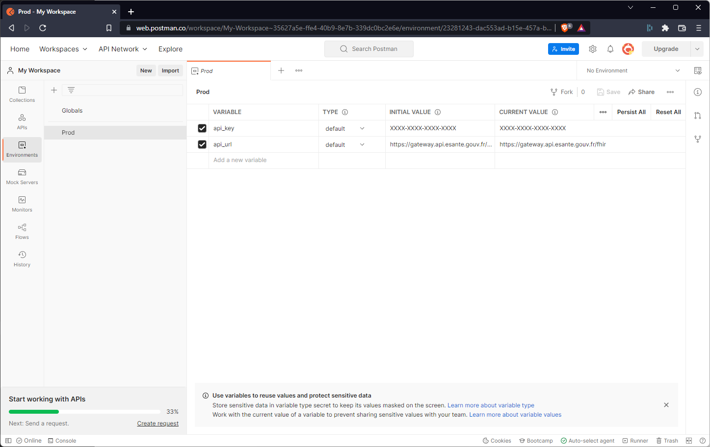
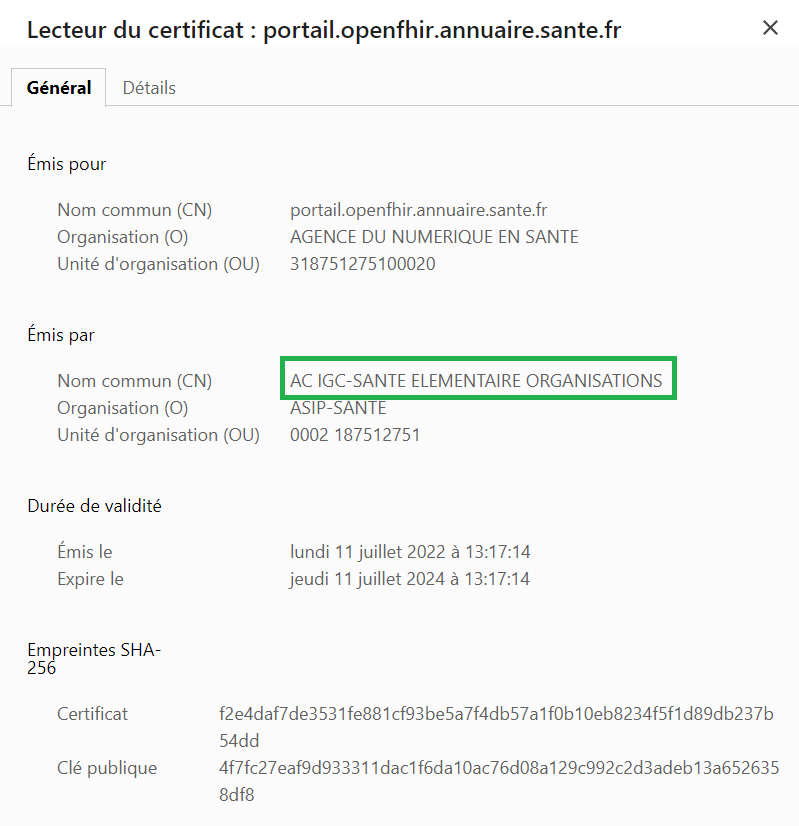

<div class="wysiwyg" markdown="1">
- [Démarrer les tests API avec Postman](#one-header)
- [Démarrer les tests API avec cURL](#two-header)
- [Utiliser le Démonstrateur API FHIR Annuaire Santé](#three-header)

</div>
<br />

## <a id="one-header"></a>1) Démarrer les tests API avec Postman


### Récupérer la collection Postman

Pour tester rapidement et facilement l'API FHIR Annuaire Santé, télécharger cette collection Postman contenant des exemples d'appels FHIR.

[](https://app.getpostman.com/run-collection/8078261-a496d05a-e735-4211-9844-31b45ba5e6dd?action=collection%2Ffork&collection-url=entityId%3D8078261-a496d05a-e735-4211-9844-31b45ba5e6dd%26entityType%3Dcollection%26workspaceId%3D0376a555-c1a8-4912-9cb4-4945375d85e8#?env%5BProd%5D=W3sia2V5IjoiYXBpX2tleSIsInZhbHVlIjoiWFhYWC1YWFhYLVhYWFgtWFhYWCIsImVuYWJsZWQiOnRydWUsInR5cGUiOiJkZWZhdWx0Iiwic2Vzc2lvblZhbHVlIjoiWFhYWC1YWFhYLVhYWFgtWFhYWCIsInNlc3Npb25JbmRleCI6MH0seyJrZXkiOiJhcGlfdXJsIiwidmFsdWUiOiJodHRwczovL2dhdGV3YXkuYXBpLmVzYW50ZS5nb3V2LmZyL2ZoaXIiLCJlbmFibGVkIjp0cnVlLCJ0eXBlIjoiZGVmYXVsdCIsInNlc3Npb25WYWx1ZSI6Imh0dHBzOi8vZ2F0ZXdheS5hcGkuZXNhbnRlLmdvdXYuZnIvZmhpciIsInNlc3Npb25JbmRleCI6MX1d)


### Configuration de la clé d'API

Une fois le projet importé dans votre espace Postman:
<div class="wysiwyg" markdown="1">
- dans le menu "Environnements": créer un environnement "Prod" et renseigner les variables nécessaires (ex: api_key et api_url)
- dans le menu "Collection": choisir un dossier et lancer un appel
- attention: vérifier bien que les variables d'environnements sont bien sélectionnées (situé en haut à droite de l'écran) et que les variables sont bien utilisées dans les appels
</div>
Veuillez trouver ci-dessous les variables utilisées dans le projet Postman: 

|Variable|Description|Valeur|
|---|---|---|
|api_key|Clé d'API (Si vous n'avez pas de clé, veuillez suivre la procédure décrite [ici](/annuaire-sante-fhir-documentation/pages/guide/version-1/getting-started/test-api.html))|Saisissez votre clé|
|api_url|L’url d’accès à l’API	|https://gateway.api.esante.gouv.fr/fhir/v2|

<p align="center">
  
</p>

## <a id="two-header"></a>2) Démarrer les tests API avec cURL

&nbsp;

NOTE| Pour la suite de l'exercice, vous devez remplacer {{site.ans.demo_key }} par votre clé d'API.

Pour ces premiers tests, nous utilisons cURL pour plus de simplicité. [cURL](https://curl.se/) étant un outil présent sur la plupart des plateformes windows 10+, macos, linux.

### Récuperer le Capability Statement FHIR


<div class="wysiwyg" markdown="1">
* **Test 1** : lancez la commande suivante pour récupérer le CapabilityStatement FHIR (liste des fonctionnalités de l'API) :
</div>
&nbsp;


<div class="code-sample"><div class="tab-content" data-name="bash">

curl -H "ESANTE-API-KEY: {{site.ans.demo_key }}" "{{site.ans.api_url}}/fhir/v2/1.x/metadata?_pretty=true&_format=json"

</div></div>
<div class="wysiwyg" markdown="1">
* Ci-dessous la réponse de l'API : 
</div>
&nbsp;

```json
{
  "resourceType": "CapabilityStatement",
  "id": "32qd281d-8a23-48f7-b936-60554f7088r8",
  "name": "RestServer",
  "status": "active",
  "date": "2024-06-21T13:49:04.892+00:00",
  "publisher": "Not provided",
  "kind": "instance",
  "software": {
    "name": "Afas Fhir server",
    "version": "V1-R4"
  },
  "implementation": {
    "description": "Afas data",
    "url": "https://{{api.url}}/fhir/v2"
  },
  "fhirVersion": "4.0.1",
  "format": [ "application/fhir+xml", "xml", "application/fhir+json", "json" ],
  "rest": [ {
      "mode": "server",
      "resource": [ {
        "type": "Device",  
                ...

```
&nbsp;

NOTE| Le capability statement permet de connaitre les fonctionnalités disponibles sur le serveur FHIR (paramètres, ressources...).


### Récuperer la ressource Practitioner


<div class="wysiwyg" markdown="1">
* <b>Test 2</b> : vous pouvez lancer cette requête pour récupérer les ressources "Practitioner" :
</div>
&nbsp;
<div class="code-sample"><div class="tab-content" data-name="bash">

curl -H "ESANTE-API-KEY: {{site.ans.demo_key }}" "{{site.ans.api_url}}/fhir/v2/1.x/Practitioner?_pretty=true&_format=json"

</div></div>

<div class="wysiwyg" markdown="1">
* Ci-dessous un exemple de réponse :
</div>
&nbsp;

```json
{
  "resourceType": "Bundle",
  "id": "42qd281d-8a23-48f7-b936-60554f7088r8",
  "meta": {
    "lastUpdated": "2024-06-21T15:19:26.205+00:00"
  },
  "type": "searchset",
  "link": [ {
    "relation": "self",
    "url": "https://{{api_url}}/fhir/v1/Practitioner?_format=json&_pretty=true"
  }, {
    "relation": "next",
    "url": "https://{{api_url}}/fhir/v1?_getpages=88b903e6-c0f1-4b36-a1db-2cde89e4fd9e&_pageId=660eb2b97bf92f0e6c8a2cdf_utyvdGWLgtp2Mvmva0tEOus0uphIlc4638ktEDhg-jetIGdYFSdDpjlaDeuOO_xzdniR6WI2Nstm84E5_d4zNqOV_1gGE6XCt7za9FJNCw4pGcBIhwa-PNoIHw9U5RU15I0TqFfyvVquK1pFYgBoguvWU6hAVIo18J9uq2b55n5RWIHJzBdRoi_DLkoDbROns3OlfWg%3D%3D&_format=json&_pretty=true&_bundletype=searchset"
  } ],
  "entry": [ {
    "fullUrl": "https://gateway.api.esante.gouv.fr/fhir/v1/Practitioner/003-3377506",
    "resource": {
      "resourceType": "Practitioner",
      "id": "003-3377506",
      "meta": {
        "versionId": "1",
        "lastUpdated": "2024-04-04T14:01:29.167+00:00",
        "source": "https://annuaire.sante.fr",
        "profile": [ "http://interop.esante.gouv.fr/ig/fhir/annuaire-donnee-publique/StructureDefinition/as-practitioner" ]
      },
      "language": "fr",
  ...
  ]
}


```

&nbsp;

## <a id="three-header"></a>3) Utiliser le Démonstrateur API FHIR Annuaire Santé

Consulter le Démonstrateur API FHIR Annuaire Santé et utiliser la clé API pour vous connecter à cette plateforme.

<p align="center">
  
</p>

NOTE| L’erreur NET::ERR_CERT_AUTHORITY_INVALID est rencontrée car le certificat exposé sur le portail de démo de l’API FHIR est un certificat issu de l’IGC Santé de l’ANS, qui n’est pas une autorité de certification reconnue par les navigateurs du marché (a contrario des Thawte, DigiCert, etc). Pour y remédier, il faut  ajouter le certificat AC IGC Santé dans votre navigateur pour qu’il soit reconnu par la suite.

Pour plus d'informations, consulter le site [IGC-Santé de l'ANS](https://igc-sante.esante.gouv.fr/PC/){:target="_blank"}

<p align="center">
  
</p>
