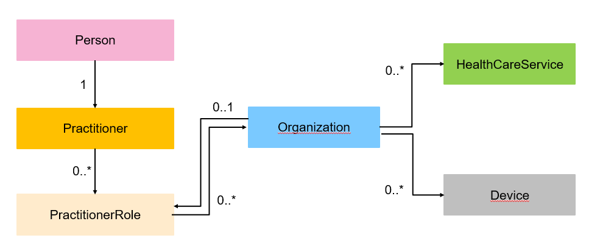

<div class="wysiwyg" markdown="1">
- [Appels Full - Synchronisation complète](#one-header)*
- [Appels Full - Récupérer les professionnels et les lieux d'exercices](#two-header)
- [Appels Full - Synchronisation complète](#one-header)

</div>


### Introduction

On peut distinguer trois types d'appels disponibles dans l'API FHIR Annuaire Santé : 

<div class="row">
    <div class="border rounded col p-2 m-1">
        <h3>Appel Full</h3>
        <hr aria-hidden="true">
        <div>
            <ul>
                <li>Récupérer l’ensemble des données en libre accès provenant de l’Annuaire Santé</li>
            </ul>
        </div>
    </div>
    <div class="border rounded col p-2 m-1">
        <h3>Appel Delta</h3>
        <hr aria-hidden="true">
        <div>
            <ul>
                <li>Faciliter la mise à jour de la base de données client via des rafraichissements deltas depuis une date souhaitée.</li>
            </ul>
        </div>
    </div>
    <div class="border rounded col p-2 m-1">
        <h3>Appel unitaire</h3>
        <hr aria-hidden="true">
        <div>
            <ul>
                <li>Obtenir les informations détaillées d’un professionnel ou d’une structure.</li>
                <li>Possibilité de récupérer les données selon des critères spécifiques choisis par l’utilisateur (par profession, par département, etc.)</li>
            </ul>
        </div>
    </div>
</div>

<br />


## <a id="one-header"></a>1)Appels Full - Synchronisation complète

Nous allons montrer comment réaliser un appel FULL d'une ressource pour synchroniser votre système local avec les données de l'**Annuaire Santé**. 

Prenons l'exemple d'un client de l'API qui souhait récupérer l'ensemble des professionnels actifs et dont la profession est Médecin. Il devra interroger la ressource Practitioner.

**Exemples de requêtes :**

```sh
GET [base]/Practitioner?qualification-code=https%3A%2F%2Fmos.esante.gouv.fr%2FNOS%2FTRE_G15-ProfessionSante%2FFHIR%2FTRE-G15-ProfessionSante%7C10&active=true
# récupère l'ensemble des professionnels actifs dont la profession est médecin (code 10) en précisant le code système

GET [base]/Practitioner?qualification-code=10&active=true
# récupère l'ensemble des professionnels actifs dont la profession est médecin sans préciser le code système

GET [base]/Practitioner?qualification-code=https%3A%2F%2Fmos.esante.gouv.fr%2FNOS%2FTRE_G15-ProfessionSante%2FFHIR%2FTRE-G15-ProfessionSante%7C10
# récupère l'ensemble des professionnels actifs et inactifs dont la profession est médecin (code 10).

```
<br />

Si ce type d'appel est lancé, le code retourné contiendra dans la première pagination les 50 premiers éléments: 

```json
{
    "resourceType": "Bundle",
    "type": "searchset",
    "id": "387c9b7f-ee25-4735-a699-4e9397b98044",
    "total": 1825942,
    "entry": [
        {
            "fullUrl": "https://gateway.api.esante.gouv.fr/fhir/v2/Practitioner/003-3014698-3057235",
            "resource": {
                "resourceType": "Practitioner",
                "id": "003-3014698-3057235",
                "meta": {
                    "versionId": "1",
                    "lastUpdated": "2025-04-28T18:19:26.335+02:00",
                    "source": "https://annuaire.sante.fr",
                    "profile": [
                        "https://hl7.fr/ig/fhir/core/StructureDefinition/fr-core-practitioner",
                        "https://interop.esante.gouv.fr/ig/fhir/annuaire/StructureDefinition/as-dp-practitioner"
                    ]
                },
                "language": "fr",
                "extension": [
                  ...
```
<br />

A la fin la réponse JSON, un lien "next" permet de consulter la prochaine pagination. Il suffit de préparer un script qui va permettre de récupérer l'url situé dans l'attribut link et d'appeler jusqu'à la dernière pagination:

<br />

```json
 "link": [
        {
            "relation": "next",
            "url": "https://gateway.api.esante.gouv.fr/fhir/v2/_page?id=u0AmXEZS9W7Bbdpqas6XBPLbNGQlIioFziyluVFRcw6zn5FNdpclx0zQDcJYMMwqFdh_sgoWYtG_iHEbgDKx_iyXjemetsvolontairementquelquechosedefauxG4nJWrE02uwuSQfBi0thMLxvb4mvtlpBvUuVF49yTCLmxZXbZy3u4Zchy-Pt3KnI0A2v-u-Aw8wXDFU9blcx1J51QuXCIBX_jSnw5QfFEjhhOQ8t0WJVdAuace64TVjP2y6g0Ed8BoZrqWpDpb-2OFb_4q7yPkN2Oib8U3tJ1rWe719OBsfnyOI_Y4dTCW5nJxOG-nuCCObru_JJZKnFSs2cJEgBk8pNUKb-7vuv9W8haT0bcHA-X7U2RIE1QNydAON7M9eF1vGslrJtqS1J1RFLXmY3i7WWWdxw2bC_QRP2DEV_p507gguZOzSqxSe73RSp7v2FG_hBGsxyt8vkHwVIt1cyONl_qSVI06SfqOb9YOHKnt_HCU_6lH8OzTum6oabtlGzdok7OuHJ2icZYAkQ_iIc4vLHaHyonB6uqbHberRc7S2UtdCGb"
        },
        {
            "relation": "self",
            "url": "https://gateway.api.esante.gouv.fr/fhir/v2/Practitioner?qualification-code=https%3A%2F%2Fmos.esante.gouv.fr%2FNOS%2FTRE_G15-ProfessionSante%2FFHIR%2FTRE-G15-ProfessionSante%7C10&active=true"
        }
    ]
}
```

## <a id="two-header"></a>1)Appels Full - Lier deux ressources

Nous allons montrer comment réaliser un appel FULL en faisant une liaison entre deux ressources.




## <a id="three-header"></a>1)Appels Full - Récupérer les professionnels et les lieux d'exercices
