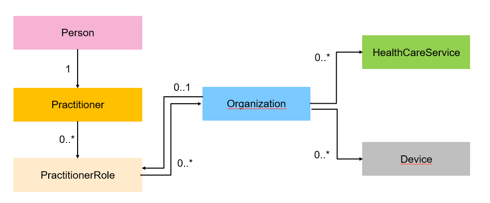

<div class="wysiwyg" markdown="1">
- [Appels Full - Synchronisation complète](#one-header)
- [Appels Delta - Mise à jour des données](#two-header)
- [Comment lier deux ressources ?](#three-header)
- [Comment récupérer les professionnels et leurs lieux d'exercices ?](#four-header)

</div>
<br />

### Introduction

On peut distinguer trois types d'appels disponibles dans l'API FHIR Annuaire Santé : 

<div class="row">
    <div class="border rounded col p-2 m-1">
        <h3>Appel Full</h3>
        <hr aria-hidden="true">
        <div>
            <ul>
                <li>Récupérer l’ensemble des données en libre accès provenant de l’Annuaire Santé</li>
            </ul>
        </div>
    </div>
    <div class="border rounded col p-2 m-1">
        <h3>Appel Delta</h3>
        <hr aria-hidden="true">
        <div>
            <ul>
                <li>Faciliter la mise à jour de la base de données client via des rafraichissements deltas depuis une date souhaitée.</li>
            </ul>
        </div>
    </div>
    <div class="border rounded col p-2 m-1">
        <h3>Appel unitaire</h3>
        <hr aria-hidden="true">
        <div>
            <ul>
                <li>Obtenir les informations détaillées d’un professionnel ou d’une structure.</li>
                <li>Possibilité de récupérer les données selon des critères spécifiques choisis par l’utilisateur (par profession, par département, etc.)</li>
            </ul>
        </div>
    </div>
</div>
<br />

### <a id="one-header"></a>1. Appels Full - Synchronisation complète

Nous allons montrer comment réaliser un appel FULL d'une ressource pour synchroniser votre système local avec les données de l'**Annuaire Santé**. 

Prenons l'exemple d'un client de l'API qui souhait récupérer l'ensemble des professionnels actifs et dont la profession est Médecin. Il devra interroger la ressource Practitioner.

**Exemples de requêtes :**

```sh
GET [base]/Practitioner?qualification-code=https%3A%2F%2Fmos.esante.gouv.fr%2FNOS%2FTRE_G15-ProfessionSante%2FFHIR%2FTRE-G15-ProfessionSante%7C10&active=true
# récupère l'ensemble des professionnels actifs dont la profession est médecin (code 10) en précisant le code système

GET [base]/Practitioner?qualification-code=10&active=true
# récupère l'ensemble des professionnels actifs dont la profession est médecin sans préciser le code système

GET [base]/Practitioner?qualification-code=https%3A%2F%2Fmos.esante.gouv.fr%2FNOS%2FTRE_G15-ProfessionSante%2FFHIR%2FTRE-G15-ProfessionSante%7C10
# récupère l'ensemble des professionnels actifs et inactifs dont la profession est médecin (code 10).
```
<br />


**Exemples de code :**

<div class="code-sample"> <div class="tab-content" data-name="curl">  curl -H "ESANTE-API-KEY: {{site.ans.api_key }}" "{{site.ans.api_url}}/fhir/v2/Practitioner"  </div> 
<div class="tab-content" data-name="java"> 
 
// Créer un contexte FHIR pour la version R4
var contexteFhir = FhirContext.forR4();
// Créer un client RESTful générique pour le serveur FHIR
var clientFhir = contexteFhir.newRestfulGenericClient("https://gateway.api.esante.gouv.fr/fhir/v2/");

// Exécuter une recherche pour les rôles de praticien avec un filtre sur la spécialité
var bundleFhir = (Bundle) clientFhir.search().forResource(PractitionerRole.class)
        // Filtrer sur la spécialité avec le code "SM02"
        .where(PractitionerRole.SPECIALTY.exactly().codes("SM02"))
        // Limiter le nombre de résultats à 10
        .count(10)
        // Exécuter la requête
        .execute();



</div> <div class="tab-content" data-name="python"> 
import requests from fhir.resources.fhirtypes import Bundle, PractitionerRole

from fhirclient import client
import fhirclient.r4.models.bundle as bundle
import fhirclient.r4.models.practitionerrole as practitionerrole

# Créer les paramètres de configuration pour le client FHIR
settings = {
    'app_id': 'my_app',
    'api_base': 'https://gateway.api.esante.gouv.fr/fhir/v2/'
}

# Créer un client FHIR
client_fhir = client.FHIRClient(settings=settings)

# Créer une requête de recherche pour les rôles de praticien
search = practitionerrole.PractitionerRole.where(structures={"specialty": "SM02"})
# Limiter le nombre de résultats à 10
search = search.limitTo(10)

# Exécuter la recherche
bundle_fhir = search.perform_resources(client_fhir.server)


</div> <div class="tab-content" data-name="C#">  
// Créer un client FHIR pour la version R4
var clientFhir = new FhirClient("https://gateway.api.esante.gouv.fr/fhir/v2/");
clientFhir.PreferredFormat = ResourceFormat.Json;
clientFhir.PreferredReturn = Prefer.ReturnRepresentation;

// Créer une requête de recherche pour les rôles de praticien
var requete = new string[] { "PractitionerRole?specialty=SM02" };
var query = new Uri(requete[0], UriKind.Relative);

// Exécuter la recherche et limiter le nombre de résultats à 10
var bundleFhir = clientFhir.Search<Bundle>(query, pageSize: 10);


</div> </div> 

Si ce type d'appel est lancé, le code retourné contiendra dans la première pagination les 10 premiers éléments: 

```json
{
    "resourceType": "Bundle",
    "type": "searchset",
    "id": "387c9b7f-ee25-4735-a699-4e9397b98044",
    "total": 1825942,
    "entry": [
        {
            "fullUrl": "https://gateway.api.esante.gouv.fr/fhir/v2/Practitioner/003-3014698-3057235",
            "resource": {
                "resourceType": "Practitioner",
                "id": "003-3014698-3057235",
                "meta": {
                    "versionId": "1",
                    "lastUpdated": "2025-04-28T18:19:26.335+02:00",
                    "source": "https://annuaire.sante.fr",
                    "profile": [
                        "https://hl7.fr/ig/fhir/core/StructureDefinition/fr-core-practitioner",
                        "https://interop.esante.gouv.fr/ig/fhir/annuaire/StructureDefinition/as-dp-practitioner"
                    ]
                },
                "language": "fr",
                "extension": [
                  ...
```
<br />
A la fin la réponse JSON, un lien "next" permet de consulter la prochaine pagination. Il suffit de préparer un script qui va permettre de récupérer l'url situé dans l'attribut link et d'appeler jusqu'à la dernière pagination:
<br />

```json
 "link": [
        {
            "relation": "next",
            "url": "https://gateway.api.esante.gouv.fr/fhir/v2/_page?id=u0AmXEZS9W7Bbdpqas6XBPLbNGQlIioFziyluVFRcw6zn5FNdpclx0zQDcJYMMwqFdh_sgoWYtG_iHEbgDKx_iyXjemetsvolontairementquelquechosedefauxG4nJWrE02uwuSQfBi0thMLxvb4mvtlpBvUuVF49yTCLmxZXbZy3u4Zchy-Pt3KnI0A2v-u-Aw8wXDFU9blcx1J51QuXCIBX_jSnw5QfFEjhhOQ8t0WJVdAuace64TVjP2y6g0Ed8BoZrqWpDpb-2OFb_4q7yPkN2Oib8U3tJ1rWe719OBsfnyOI_Y4dTCW5nJxOG-nuCCObru_JJZKnFSs2cJEgBk8pNUKb-7vuv9W8haT0bcHA-X7U2RIE1QNydAON7M9eF1vGslrJtqS1J1RFLXmY3i7WWWdxw2bC_QRP2DEV_p507gguZOzSqxSe73RSp7v2FG_hBGsxyt8vkHwVIt1cyONl_qSVI06SfqOb9YOHKnt_HCU_6lH8OzTum6oabtlGzdok7OuHJ2icZYAkQ_iIc4vLHaHyonB6uqbHberRc7S2UtdCGb"
        },
        {
            "relation": "self",
            "url": "https://gateway.api.esante.gouv.fr/fhir/v2/Practitioner?qualification-code=https%3A%2F%2Fmos.esante.gouv.fr%2FNOS%2FTRE_G15-ProfessionSante%2FFHIR%2FTRE-G15-ProfessionSante%7C10&active=true"
        }
    ]
}
```
<br />

### <a id="two-header"></a>2. Appels Delta - Mise à jour des données

Nous allons montrer comment réaliser un appel delta d'une ressource pour réaliser la mise à jour des données de l'Annuaire Santé.

Prenons l'exemple d'un client de l'API qui souhait mettre à jour l'ensemble des professionnels actifs et dont la profession est Médecin. Il devra interroger la ressource Practitioner.

```sh
GET [base]/Practitioner?qualification-code=10&_lastUpdated=ge2025-05-27
# récupère l'ensemble des professionnels dont la profession est médecin qui ont été mis à jour entre le 27 mai 2025 et aujourd'hui.
```
<br />
Cet appel delta vous permettra de remonter l'ensemble des professions qui ont été mis à jour entre la date définie et aujourd'hui. Vous pourrez ainsi constater des ressources qui vont voir des changements de statut "active = false"

Note| Les appels delta ne peuvent pas excéder plus de 30 jours. Le serveur ne garde pas les mises à jour réalisées au-delà de 30 jours.

Si ce type d'appel est lancé, l'appel delta remontera près de 9903 entrées qui ont été mises à jour depuis le 27 mai 2025. Le code retourné contiendra dans la première pagination les 50 premiers éléments :

```json
{
    "resourceType": "Bundle",
    "type": "searchset",
    "id": "05978e52-41ca-4a10-a204-ebdaaf0e2230",
    "total": 9903,
    "entry": [
        {
            "fullUrl": "https://gateway.api.esante.gouv.fr/fhir/v2/Practitioner/003-3422245-5139408",
            "resource": {
                "resourceType": "Practitioner",
                "id": "003-3422245-5139408",
                "meta": {
                    "versionId": 2,
                    "lastUpdated": "2025-05-27T10:16:30.021+02:00",
                    "source": "https://annuaire.sante.fr",
                    "profile": [
                        "https://hl7.fr/ig/fhir/core/StructureDefinition/fr-core-practitioner",
                        "https://interop.esante.gouv.fr/ig/fhir/annuaire/StructureDefinition/as-dp-practitioner"
                    ]
                },
                "language": "fr",
                "extension": [
                    {
```
<br />
A la fin la réponse JSON, un lien "next" permet de consulter la prochaine pagination. Il suffit de préparer un script qui va permettre de récupérer l'url situé dans l'attribut link et d'appeler jusqu'à la dernière pagination pour récupérer l'ensemble de vos deltas.

```json
 "link": [
        {
            "relation": "next",
            "url": "https://gateway.api.esante.gouv.fr/fhir/v2/_page?id=u0AmXEZS9W7Bbdpqas6XBPLbNGQlIioFziyluVFRcw6zn5FNdpclx0zQDcJYMMwqFdh_sgoWYtG_iHEbgDKx_iyXjemetsvolontairementquelquechosedefauxG4nJWrE02uwuSQfBi0thMLxvb4mvtlpBvUuVF49yTCLmxZXbZy3u4Zchy-Pt3KnI0A2v-u-Aw8wXDFU9blcx1J51QuXCIBX_jSnw5QfFEjhhOQ8t0WJVdAuace64TVjP2y6g0Ed8BoZrqWpDpb-2OFb_4q7yPkN2Oib8U3tJ1rWe719OBsfnyOI_Y4dTCW5nJxOG-nuCCObru_JJZKnFSs2cJEgBk8pNUKb-7vuv9W8haT0bcHA-X7U2RIE1QNydAON7M9eF1vGslrJtqS1J1RFLXmY3i7WWWdxw2bC_QRP2DEV_p507gguZOzSqxSe73RSp7v2FG_hBGsxyt8vkHwVIt1cyONl_qSVI06SfqOb9YOHKnt_HCU_6lH8OzTum6oabtlGzdok7OuHJ2icZYAkQ_iIc4vLHaHyonB6uqbHberRc7S2UtdCGb"
        },
        {
            "relation": "self",
            "url": "https://gateway.api.esante.gouv.fr/fhir/v2/Practitioner?qualification-code=https%3A%2F%2Fmos.esante.gouv.fr%2FNOS%2FTRE_G15-ProfessionSante%2FFHIR%2FTRE-G15-ProfessionSante%7C10&active=true"
        }
    ]
}
```
<br />

### <a id="three-header"></a>3. Comment lier deux ressources ?

Nous allons montrer comment réaliser un appel FULL en faisant une liaison entre deux ressources. Ci-dessous un schéma sur la modélisation entre les différentes ressources :



Pour réaliser la liaison entre deux ressources, vous devez utiliser les modificateurs de résultats de recherche _include ou_revinclude. Le standard FHIR propose par exemple le paramètre _include qui va inclure dans les résultats de réponse des éléments qui sont référencés dans la recherche principale. 

Le tableau suivant indique le type de modificateurs de résultat de recherche que vous pouvez utiliser sur chaque ressource :

| Ressource         | Paramètres  | Description                       |
| ---               | ---         | ---                               |
| Practitioner      | _revinclude | PractitionerRole:practitioner     |
| PractitionerRole  | _include    | PractitionerRole:practitioner     |
| PractitionerRole  | _include    | PractitionerRole:organization     |
| Organization      | _include    | Organization::partof              |
| Organization      | _revinclude | Device:organization               |
| Organization      | _revinclude | HealthcareService:organization    |
| Organization      | _revinclude | PractitionerRole:organization     |
| Organization      | _include    | Device:organization               |
| Device            | _include    | Device:organization               |
| HealthcareService | _include    | HealthcareService:organization    |

Ainsi il est possible de lier:
<div class="wysiwyg" markdown="1">
- A partir du Practitioner : lier avec le Practitioner
- A partir du PractitionerRole: lier avec le Practitioner ou avec l'Organization
- A partir de l'Organization : lier avec le PractitionerRole, le Device ou le HealthCareService
- A partir du Device: lier avec l'Organization
- A partir du HealthCareService : lier avec l'Organization
</div>

<br />
Cas d'exemple: pour visualiser les exercices professionnels d'un professionnel et ses activités, il faut lancer le type d'appel suivant :

```sh
GET [base]/Practitioner?_revinclude=PractitionerRole:practitioner
# récupère les exercices du professionnels et inclure leurs activités liées
```
<br />


 
### <a id="four-header"></a>4. Comment récupérer les professionnels et leurs lieux d'exercices ?

Imaginons par exemple que vous souhaitez réaliser une recherche sur les Practitioner qui ont au moins un PractitionerRole rattaché à une Organization dans le département 78. 

Nous vous conseillons de réaliser deux types de requêtes :

<div class="wysiwyg" markdown="1">
- Une première requête sur la ressource qui contient le paramètre souhaité. Dans notre cas, c'est Organization. Vous pouvez avec cette requête récupérer les PractitionerRole associés à chaque organisation grâce à la fonction "_revinclude". Le _revinclude vous remontera tous les id techniques des PractitionerRole
- Une deuxième requête pour trouver les Practitioner associés aux PractitionerRole. Vous avez plusieurs possibilités : récupérer les Practitioner et les PractitionerRole et faire une requête par rapport à l'ID technique des PractitionerRole
</div>
 <br />

```sh
GET [base]/Organization?_revinclude=PractitionerRole:organization
# Exemple avec la première requête pour récupérer les organisations et remonter les activités associées.
```
 <br />
La requête _has permettrait également de faire ce type de requête mais n'est pour le moment pas implémenté dans l'API FHIR V2.

```sh
GET [base]/Practitioner?_has:PractitionerRole:practitioner:organization.address-postalcode=78
```

