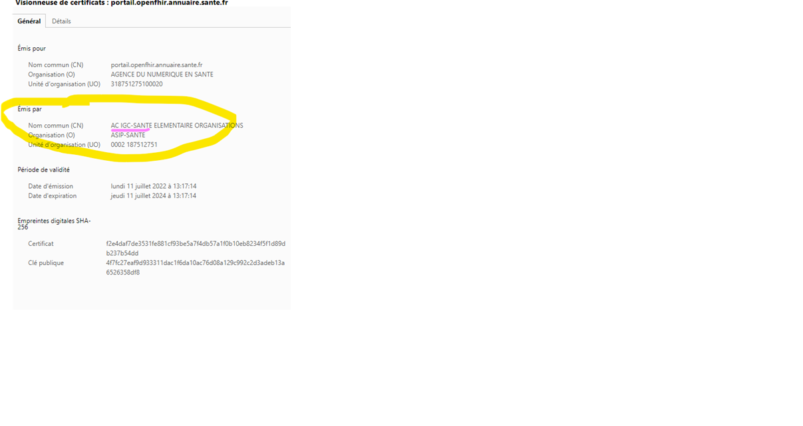

### URL d'accès (base url)

Tous les accès se font via HTTPS.

#### Environnement Production
<div class="wysiwyg"  markdown="1">
- [api-url] : https://gateway.api.esante.gouv.fr/fhir/v1
- [ihm-url] : https://portail.openfhir.annuaire.sante.fr 
- [gravitee-url] : https://portal.api.esante.gouv.fr        (pour obtenir une API KEY)
</div>
<br />

#### Environnement Bac à sable (en accès restreint)
<div class="wysiwyg"  markdown="1">
- [api-url] : https://gateway.preprod.api.esante.gouv.fr/fhir/v1
- [ihm-url] : https://demo.portail.openfhir.annuaire.asipsante.fr 
- [gravitee-url] : https://portal.preprod.api.esante.gouv.fr
</div>
<br />
 
### Points de terminaison (endpoints)
<div class="wysiwyg"  markdown="1">
- [api-url]/Practitioner    (pour les professionnels de santé)
- [api-url]/PractitionerRole   (pour les exercices pro et les situations d'exercice)
- [api-url]/Organization    (pour les structures)
- [api-url]/HealthcareService   (pour les activités de soins et les équipements sociaux)
- [api-url]/Device    (pour les équipements matériels lourds)
- [api-url]/metadata    (pour le capability statement)
- [api-url]/health    (pour le heathcare du service, accessible sans authentification)
</div>
<br />

### Méthodes HTTP (http verbs)
L'API est conforme à la norme REST. Vous pouvez utiliser les ressources avec les méthodes HTTP suivantes :
<div class="wysiwyg"  markdown="1">
- GET : lecture de données simple  (Regex Posix : \/fhir\/(v[0-9]{0,2}\/)?[a-zA-Z]{0,30} )
- POST : lecture de données au format POST  (Regex Posix : \/fhir\/(v[0-9]{0,2}\/)?[a-zA-Z]{0,30}\/_search )
</div>
<br />

### En-têtes (headers)
<div class="wysiwyg"  markdown="1">
- ESANTE-API-KEY  
</div>
<br />

```xml
-- Exemple :

  curl 
    -H "ESANTE-API-KEY: XXXX-XXXX-XXXX-XXXXX"  \
    "[api-url]/metadata"  
    
    -- XXXX-XXXX-XXXX-XXXXX étant l'API KEY

```
<br />

### Construction de la réponse de base

#### Réponse de base -- Succès

Lien vers la spécification FHIR : <https://www.hl7.org/fhir/R4/bundle.html>

Si la recherche est un succès, le serveur répond :
<div class="wysiwyg"  markdown="1">
- Un header avec un code 200 OK HTTP
- Un body contenant une ressource [Bundle](https://www.hl7.org/fhir/R4/bundle.html) dont le type = searchset.
Le bundle encapsule 0 à n ressources Location corespondant aux critères de recherche plus les ressources incluses correspondant aux critères de recherche.
Le service développé renvoie les 200 premiers résultats et indique le total trouvé dans une balise `total`. Dans le cas où il n'y a pas de résultat le service renvoie `total`: 0.
</div>
<br />

NOTE| La recherche est un succès à partir du moment où la requête peut être exécutée. Il peut il y avoir 0 à n correspondances.
Plus de précision sur la spécification FHIR : https://www.hl7.org/fhir/R4/http.html

#### Réponse de base -- Echec

Lien vers la spécification FHIR : <https://www.hl7.org/fhir/R4/operationoutcome.html>

Si la recherche échoue, le serveur doit répondre :
<div class="wysiwyg"  markdown="1">
- Un header avec un un code erreur HTTP 4XX ou 5XX
- Un body contenant une ressource OperationOutcome[^3] qui donne les détails sur la raison de l'échec
</div>
<br />

NOTE| L'échec d'une recherche est la non-possibilité d'exécuter la requête, ce qui est différent d'aucune correspondance à la recherche.
Plus de précision sur la spécification FHIR : <https://www.hl7.org/fhir/R4/http.html>

### Codes d’état HTTP (HTTP status codes)
Toutes les réponses utilisent des codes d'état HTTP standard.

<div class="wysiwyg"  markdown="1">
- 200 (OK) : Successful request (OK)
- 403 (Forbidden) : The request is not allowed
- 404 (Not found) : The resource is not found 
</div>
<br />

### Erreur NET::ERR_CERT_AUTHORITY_INVALID sur l'IHM (https://portail.openfhir.annuaire.sante.fr)
L’erreur NET::ERR_CERT_AUTHORITY_INVALID est rencontrée car le certificat exposé sur le portail de démo de l’API FHIR est un certificat issu de l’IGC Santé de l’ANS, qui n’est pas une autorité de certification reconnue par les navigateurs du marché (a contrario des Thawte, DigiCert, etc).
Pour y remédier, il faut  ajouter l’AC IGC Santé dans le navigateur pour qu’elle soit reconnue par la suite. 

<p align="center">
  
</p>

### Paramètres d’entrée

Les paramètres et critères de recherche de l'API sont standard FHIR  :
<div class="wysiwyg"  markdown="1">
-	Paramètres : https://www.hl7.org/fhir/search.html
-	Critères de recherche : https://www.hl7.org/fhir/searchparameter-registry.html
-	Paramètres créés pour les recherches sur les champs inclus dans des extensions et autres : https://www.hl7.org/fhir/searchparameter.html
</div>
<br />
NOTE| Pour plus de détails sur les paramètres d’entrées de l'API, se référer au CapabilityStatement : [api-url]/metadata

### Paramètres et modificateurs de requêtes FHIR

Sont supportés les paramètres et le modificateurs suivants :
<div class="wysiwyg"  markdown="1">
- _revinclude, 
- _include
- _count : 50 est la valeur par défaut
- _total : none, estimate, accurate. le calcul du total par le service n'est pas systématique car ça dépend du temps nécessaire à son  calcul. si ce temps est important, le total ne sera pas affiché.
- Tous les préfixes de comparaison 
- Préfixes [date](https://hl7.org/FHIR/search.html#date): eq (equal), ge (greater equal), gt (greater than), lt (less than), le (less equal)
- _elements : permet de préciser la liste d’attributs qui doit être retournée avec la ressource.
</div>
<br />

### Pagination

Lorsqu’une réponse inclut de nombreux résultats, l'API les pagine et en retourne une partie. Par défaut, elle ne retourne que 50 
éléments .Quand une réponse est paginée, les réponses incluent des  liens permettant de récupérer les pages suivantes.
Seul le lien Next est supporté.

### Suppression d'une ressource (active=false ; status=inactive) 

De manière générale, la ressource n'est plus publiée dans l'API à partir du moment où elle devient inactive. Cependant, elle ne disparait pas complétement de l'API puisqu'elle reste présente dans le delta avec uniquement son id et le champs active = false (device : status inactive). Ce fonctionnement permet notamment aux consommateurs du delta d'isoler les ressources supprimées entre deux dates (synchronisations).

<div class="wysiwyg"  markdown="1">
- active=false pour l'ensemble des ressources excepté Device (exemple : [api-url]/Practitioner?active=false)
- status=false pour Device (exemple : [api-url]/Device?status=inactive)
</div>
<br />

```json

{
    "resourceType": "Bundle",
    "id": "835a413a-d78e-4e80-8735-7a9e14b1b4e9",
    "meta": {
        "lastUpdated": "2023-11-02T10:02:24.909+00:00"
    },
    "type": "searchset",
    "total": 1,
    "link": [
        {
            "relation": "self",
            "url": "https://gateway.preprod.api.esante.gouv.fr/fhir/v1/Practitioner?_id=003-118475&active=false"
        }
    ],
    "entry": [
        {
            "fullUrl": "https://gateway.api.esante.gouv.fr/fhir/v1/Practitioner/003-118475",
            "resource": {
                "resourceType": "Practitioner",
                "id": "003-118475",
                "meta": {
                    "versionId": "2",
                    "lastUpdated": "2023-09-05T08:55:12.763+00:00",
                    "source": "https://annuaire.sante.fr",
                    "profile": [
                        "https://annuaire.sante.gouv.fr/fhir/StructureDefinition/AS-Practitioner"
                    ]
                },
                "active": false
            }
        }
    ]
}


```