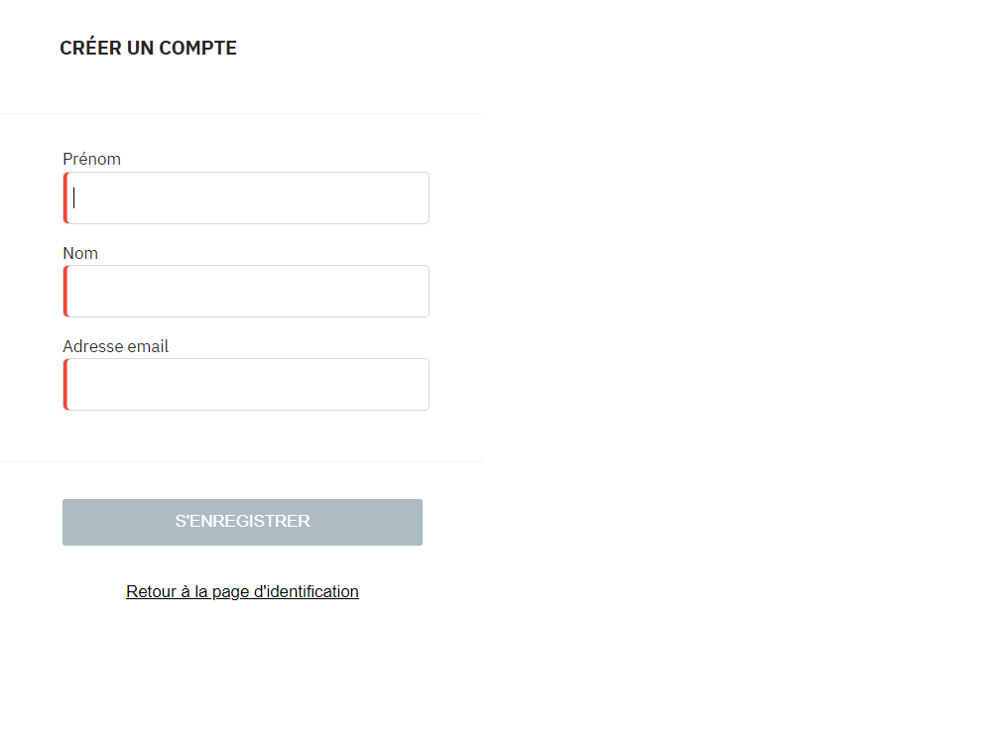
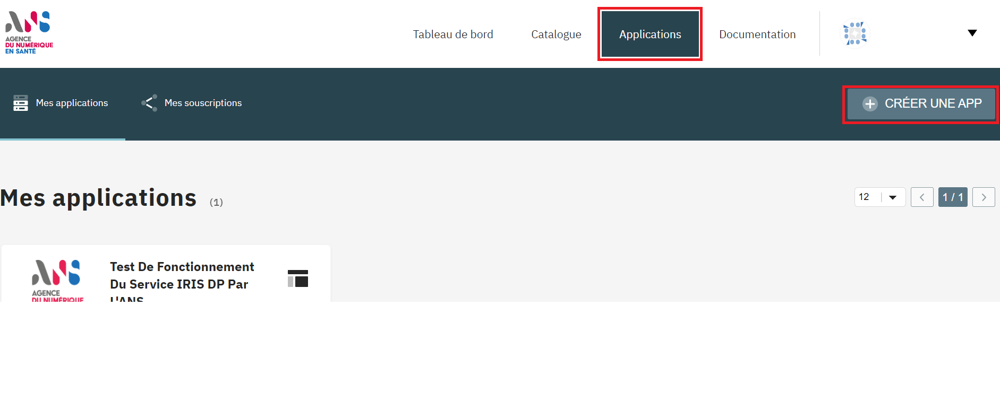
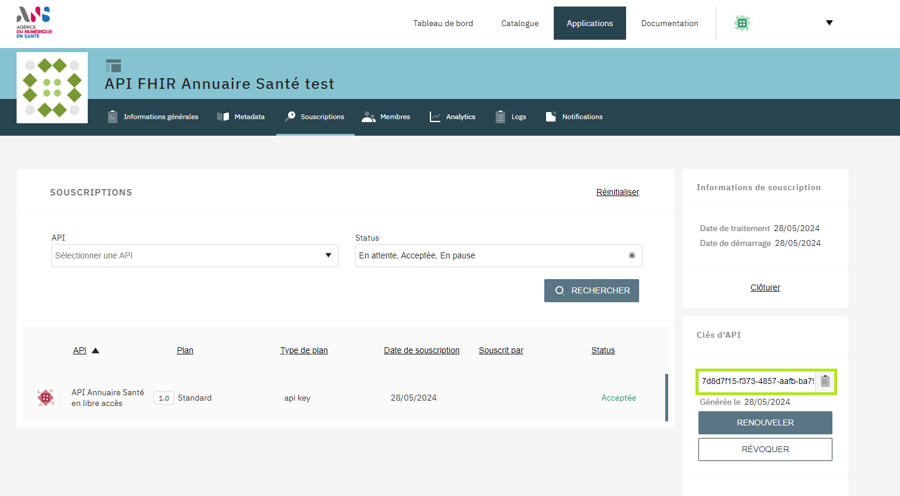
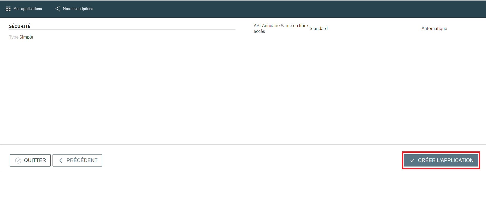
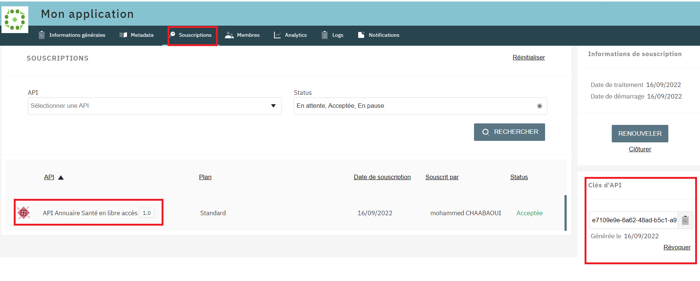

#### Dans cette page
<div class="wysiwyg" markdown="1">
- [Prérequis](#zero-header)
- [Création d'un compte](#one-header)
- [Création d'une application](#two-header)
- [Tester l'API](#three-header)
- [Aller plus loin](#four-header)
</div>
<br />


Ce guide explique comment obtenir une clé d'API et la configurer pour effectuer votre premier appel à l'API.

<p align="center">
  
</p>


## <a id="zero-header"></a>0) Prérequis pour démarrer avec l'API
Pour appeler l'API, il est nécessaire de disposer d'une clé d'API. Pour obtenir cette clé, vous devez vous rendre sur l’outil de gestion d’API de l'ANS :
[GRAVITEE](https://portal.api.esante.gouv.fr/catalog/api/962f412b-e08e-4ee7-af41-2be08eeee7f6){:target="_blank"}.


## <a id="one-header"></a>1) Création d'un compte dans Gravitee
Il s'agit de votre première connexion à l'outil Gravitee, vous devez créer un compte.
<div class="wysiwyg" markdown="1">
* Rendez-vous sur le portail Gravitee à l'adresse : [ENREGISTREZ-VOUS](https://portal.api.esante.gouv.fr/user/registration){:target="_blank"}
* Saisissez votre prénom, votre nom et une adresse email, puis valider votre saisie en cliquant sur le bouton 
* À l'issue de la création de votre compte, un email de confirmation vous est envoyé à l'adresse email que vous avez indiquée. Cet email contient un lien permettant de terminer le processus de validation de votre compte.
</div>
&nbsp;

{:style="max-width:600px"}

NOTE|L'adresse email est indispensable pour créer un compte dans Gravitee. Si vous n'avez pas d'adresse email, vous devez en créer une.
   

## <a id="two-header"></a>2) Création d'une application dans Gravitee
Cette étape concerne les utilisateurs qui n’ont pas encore créé d’application à souscrire à l’API.
Pour créer une application, vous devez suivre les étapes suivantes :
<div class="wysiwyg" markdown="1">
* Connectez-vous sur le portail Gravitee à l'adresse : [IDENTIFIEZ-VOUS](https://portal.api.esante.gouv.fr/user/login){:target="_blank"}
* Dans l'onglet "Applications", cliquer sur "CREER UNE APP".
</div>
&nbsp;

{:style="max-width:600px"}

<div class="wysiwyg" markdown="1">
* Ensuite, remplissez les informations générales requises pour l'application.
</div>
&nbsp;

{:style="max-width:600px"}

<div class="wysiwyg" markdown="1">
* Pour souscrire votre application à l’API, vous pouvez rechercher "API Annuaire Santé en libre accès".
</div>
&nbsp;

{:style="max-width:600px"}
{:style="max-width:600px"}

<div class="wysiwyg" markdown="1">
* Une fois la création de l’application terminée, une clé d'API vous est automatiquement générée. Celle-ci est disponible dans l’onglet "SOUSCRIPTIONS" de votre Application.
</div>
&nbsp;

{:style="max-width:600px"}


## <a id="three-header"></a>3) Tester l'API
Pour ces premiers tests, nous utilisons cURL pour plus de simplicité. [cURL](https://curl.se/) étant un outil présent sur la plupart des plateformes windows 10+, macos, linux.
<div class="wysiwyg" markdown="1">
* <b>Test 1</b> : lancez la commande suivante pour récupérer le CapabilityStatement FHIR (liste des fonctionnalités de l'API) : 
</div>
&nbsp;

TIPS| Pour la suite de l'exercice, vous devez remplacer {{site.ans.demo_key }} par votre clé d'API.

<div class="code-sample"><div class="tab-content" data-name="bash">

curl -H "ESANTE-API-KEY: {{site.ans.demo_key }}" "{{site.ans.api_url}}/fhir/metadata?_pretty=true&_format=json"

</div></div>
<div class="wysiwyg" markdown="1">
* La réponse de l'API devrait ressembler à ceci : 
</div>
&nbsp;

```json
{
  "resourceType": "CapabilityStatement",
  "fhirVersion": "4.0.1",
  "format": [ "application/fhir+xml", "xml", "application/fhir+json", "json" ],
  "rest": [ {
    ...


```
&nbsp;
&nbsp;
NOTE| Le capability statement permet de connaitre les fonctionnalités disponibles sur le serveur FHIR (paramètres, ressources...).

<div class="wysiwyg" markdown="1">
* <b>Test 2</b> : vous pouvez lancer cette requête pour récupérer les ressources "Practitioner" :
</div>
&nbsp;
<div class="code-sample"><div class="tab-content" data-name="bash">

curl -H "ESANTE-API-KEY: {{site.ans.demo_key }}" "{{site.ans.api_url}}/fhir/Practitioner?_pretty=true&_format=json"

</div></div>

<div class="wysiwyg" markdown="1">
* La réponse devrait ressembler à cela :
</div>
&nbsp;

```json
{
  "resourceType": "Bundle",
  "entry": [ {
    "fullUrl": "https://.../fhir/v1/Practitioner/pra-59",
    "resource": {
      "resourceType": "Practitioner",
      "id": "pra-59",
    }
  }, {
    "fullUrl": "https://.../fhir/v1/Practitioner/pra-57",
    "resource": {
      "resourceType": "Practitioner",
      "id": "pra-57",
      ...
    }
  }
  ...
  ]
}


```

&nbsp;


## <a id="four-header"></a>Aller plus loin


#### Ressources internes 

<div class="wysiwyg" markdown="1">
* Démarrage par langage: [JAVA]({{ '/pages/documentation/starters/java-starter.html' | relative_url }}),  [PHP]({{ '/pages/documentation/starters/php-starter.html' | relative_url }})
* [Accéder aux ressources]({{ '/pages/hub' | relative_url }})
* [Cas d'utilisation de synchronisation]({{ '/pages/use-cases/full/index' | relative_url }})
* [Cas d'utilisation d'appels unitaires]({{ '/pages/use-cases/practitioner-detail/index' | relative_url }})
</div>

&nbsp;

#### Ressources externes

<div class="wysiwyg" markdown="1">
* [Site officiel de FHIR](https://www.hl7.org/fhir/){:target="_blank"}
* [Librairie Java FHIR](https://hapifhir.io/){:target="_blank"}
* [Profils de l'annuaire santé](TODO){:target="_blank"}
</div>