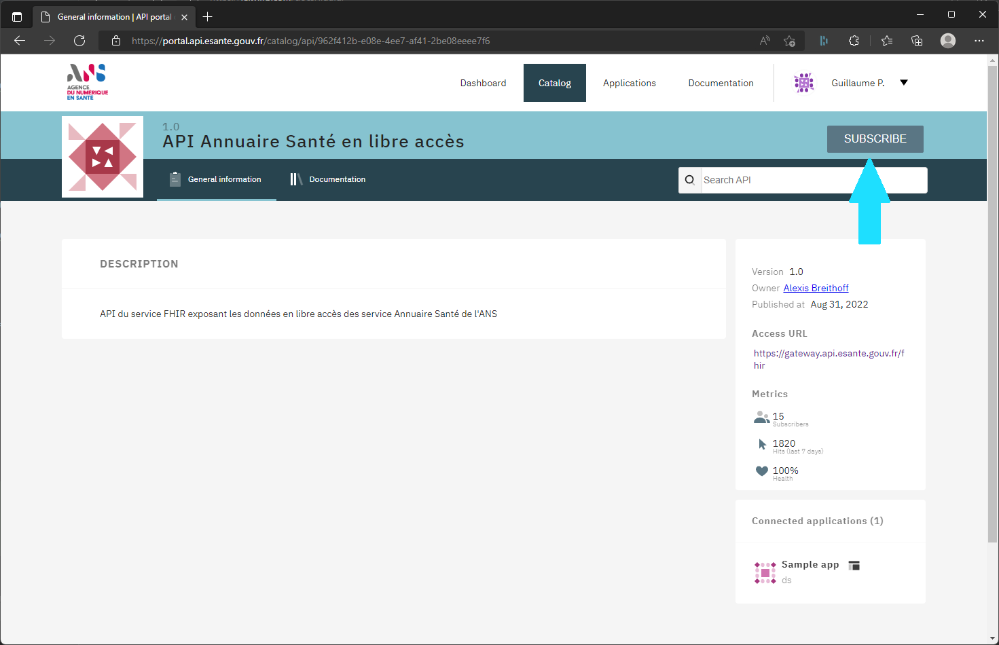
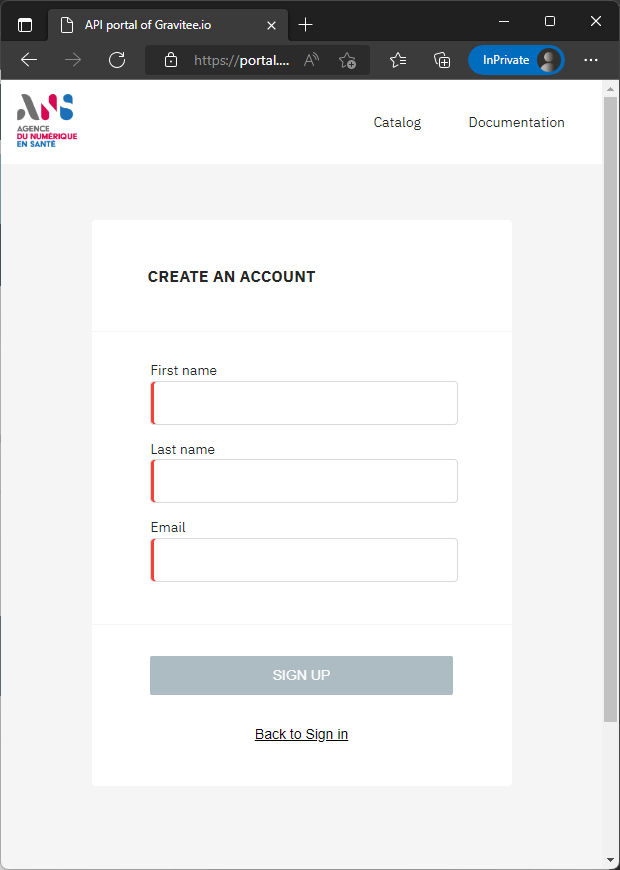
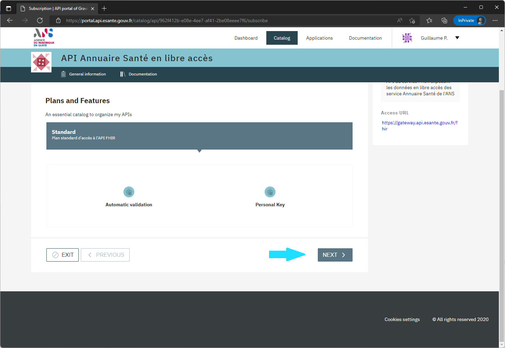
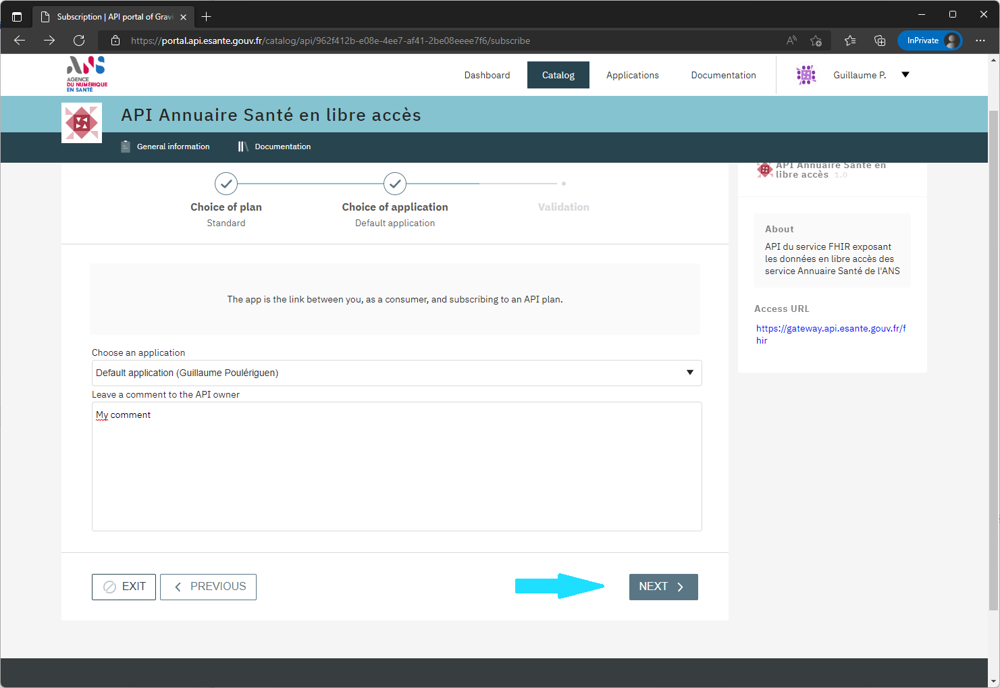
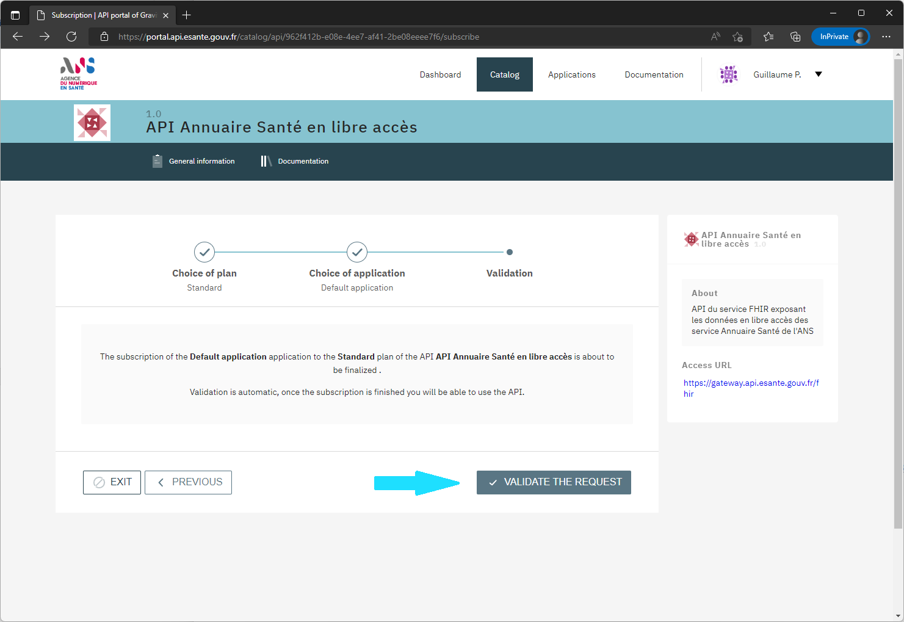
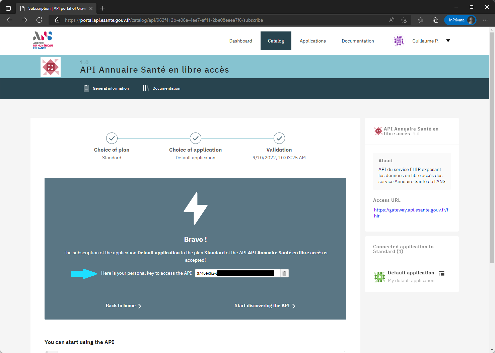

Pour appeler l'API, il est nécessaire de spécifier une API Key dans le header. Pour obtenir cette clé, vous devez vous rendre sur l'interface de [création de compte](https://portal.api.esante.gouv.fr/catalog/api/962f412b-e08e-4ee7-af41-2be08eeee7f6){:target="_blank"}.

1) Accédez au site

{:style="max-width:600px"}

2) Cliquez sur "Subscribe" en haut à droite

3) Créez votre compte (si vous n'en avez pas)

Crééz en un avec le lien "Sign up" sous le bouton "Sign in"

{:style="max-width:400px"}

Vous allez recevoir un email pour confirmer votre adresse email. Cliquez le lien du mail et saisissez un mot de passe. 

Enfin reconnectez vous avec votre adresse email et le mot de passe précédement saisi.

4) Enregistrement

Une fois connecté rendez vous sur la page de l'api : [Page api](https://portal.api.esante.gouv.fr/catalog/api/962f412b-e08e-4ee7-af41-2be08eeee7f6){:target="_blank"}

Cliquez à nouveau sur le lien "SUBSCRIBE" en haut à droite

Cliquez sur le bouton "NEXT" en bas à droite : 

{:style="max-width:600px"}

Choisissez l'application par défaut et vous pouvez saisir un commentaire. Puis cliquez sur le bouton "NEXT" en bas à droite : 

{:style="max-width:600px"}

La dernière étape est de valider la demande avec le bouton "VALIDATE THE REQUEST" en bas à droite : 

{:style="max-width:600px"}


Vous obtenez une clé API. Pensez à la noter et la conserver car elle ne sera plus donnée: 

{:style="max-width:600px"}


Une fois votre clé obtenue, vous aurez accès à l'API.


## Votre premier appel API

Pour cette section, nous utilisons curl qui est un outil présent sur la plupart des plateformes windows 10+, macos, linux.

Lancez la commande suivante pour récupérer le CapabilityStatement FHIR (liste des fonctionnalités du serveur) : 


TIPS| Dans chaque exemple, veuillez remplacer {{site.ans.demo_key }} par votre clé api.


<div class="code-sample"><div class="tab-content" data-name="bash">


curl -H "ESANTE-API-KEY: {{site.ans.demo_key }}" "{{site.ans.api_url}}/fhir/metadata?_pretty=true&_format=json"


  
</div></div>


Si tout s'est bien passé, vous devriez avoir un résultat similaire à : 

```json
{
  "resourceType": "CapabilityStatement",
  "fhirVersion": "4.0.1",
  "format": [ "application/fhir+xml", "xml", "application/fhir+json", "json" ],
  "rest": [ {
    ...
```

&nbsp;

NOTE| Le capability statement permet de connaitre les fonctionnalités disponibles sur le serveur FHIR (paramètres, ressources...).


Vous pouvez lancer la même requête sur une ressource par exemple pour récupérer les Practitioner:


<div class="code-sample"><div class="tab-content" data-name="bash">


curl -H "ESANTE-API-KEY: {{site.ans.demo_key }}" "{{site.ans.api_url}}/fhir/Practitioner?_pretty=true&_format=json"


</div></div>


La réponse devrait ressembler à cela :

```json
{
  "resourceType": "Bundle",
  "entry": [ {
    "fullUrl": "https://.../fhir/v1/Practitioner/pra-59",
    "resource": {
      "resourceType": "Practitioner",
      "id": "pra-59",
    }
  }, {
    "fullUrl": "https://.../fhir/v1/Practitioner/pra-57",
    "resource": {
      "resourceType": "Practitioner",
      "id": "pra-57",
      ...
    }
  }
  ...
  ]
}
```

&nbsp;


## Aller plus loin


### Ressources internes 

<div class="wysiwyg" markdown="1">
* Démarrage par langage: [JAVA]({{ '/pages/documentation/starters/java-starter.html' | relative_url }})  [PHP]({{ '/pages/documentation/starters/php-starter.html' | relative_url }})
* [Accéder aux ressources]({{ '/pages/hub' | relative_url }})
* [Use case de synchronisation]({{ '/pages/use-cases/full/index' | relative_url }})
* [Use d'appels unitaires]({{ '/pages/use-cases/practitioner-detail/index' | relative_url }})
</div>

&nbsp;

### Ressources externes

<div class="wysiwyg" markdown="1">
* [Site officiel de FHIR](https://www.hl7.org/fhir/){:target="_blank"}
* [Librairie Java FHIR](https://hapifhir.io/){:target="_blank"}
* [Profils de l'annuaire santé](TODO){:target="_blank"}
</div>
