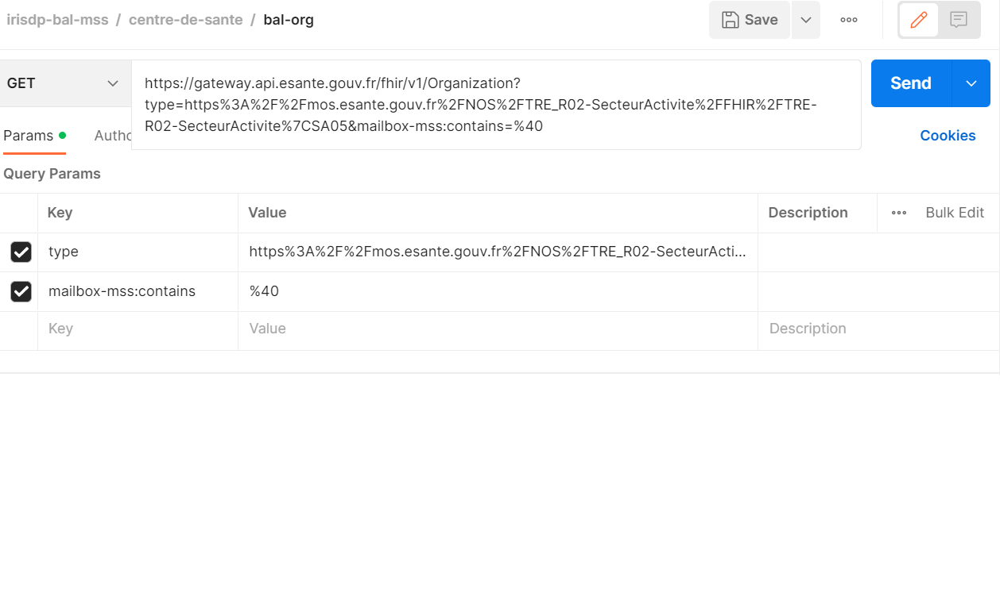

 
L’ANS, en tant que régulateur de l’espace national de confiance MSSanté, tient à jour l’annuaire national MSSanté, qui rassemble toutes les BAL (boîtes aux lettres) transmises par les opérateurs de l’espace de confiance.
L’opérateur transmet, pour chaque BAL du périmètre cité, un identifiant national de personne (RPPS ou ADELI) et/ou un identifiant de structure (FINESS pour les BAL rattachées à un établissement de santé).

Il existe plusieurs types de BAL :

* les BAL (boîtes aux lettres) « personnelles » des personnes physiques disposant d’un identifiant RPPS ou d’un identifiant ADELI, dont l’usage est sous la responsabilité exclusive du porteur de l’adresse ;
* les BAL « personnelles » non rattachées à un identifiant national ; ces BAL sont attribuées à des personnes dont l’identité est enregistrée par une personne morale (établissement de santé…) responsable de l’accès et de l’usage de la BAL ;
* les BAL « organisationnelles » associées à un service ou à une équipe, rattachées à une personne morale responsable de l’accès et de l’usage de la BAL ;
* les BAL « applicatives » associées à un logiciel métier ou à une machine et utilisées à des fins d’envois ou de réception automatisés, rattachées à une personne morale responsable de l’accès et de l’usage de la BAL.

 

## 1. Centres de santé
### 1.1 Les BAL organisationnelles
Afin d'extraire les BAL MSSanté organisationnelles , il faut interroger l’endpoint Organization.

Nous appliquerons deux filtres à la requête afin d’obtenir le résultat attendu :

 * le type d'organization : SA5 (ici, le type correspond  au secteur d'activité SA05 => Centre de santé) 
 * Et en n'incluant que les organizations ayant au moins d'une BAL MSS

 

 
Faire un appel sur l'endpoint Organization en filtrant sur les Organization :
  * de type SA05 (type=https%3A%2F%2Fmos.esante.gouv.fr%2FNOS%2FTRE_R02-SecteurActivite%2FFHIR%2FTRE-R02-SecteurActivite)
  * et ayant au moins un mailbox (mailbox-mss:contains=%40 )
 

  
 curl -H "ESANTE-API-KEY: {{site.ans.demo_key }}" "{{site.ans.api_url}}/fhir/v1/Organization?type=https%3A%2F%2Fmos.esante.gouv.fr%2FNOS%2FTRE_R02-SecteurActivite%2FFHIR%2FTRE-R02-SecteurActivite%7CSA05&mailbox-mss:contains=%40" 
 
 

  
  

  

 Le résultat retourné est un Bundle contenant la première page de résultat. Il contient aussi le nombre total d'éléments retournés par la requête pouvant être récupérés sur les pages suivantes.
 
 L’exécution de l’exemple de code peut donner un résultat équivalent :
   

 * Schéma montrant les champs TOTAL et Page suivante : 

 * Schéma montrant les champs BAL MSS et Type de BAL : 

 * Schéma montrant les champs N° FINESS, Raison sociale et N° département : 

 
 
 
## 2. Laboratoires
TODO
  
## 3. Officines
TODO
  
## 4. EPHAD
TODO
  
## Focus sur le mapping des données Extraction fichier vs API
 Pour les utilisateurs des extractions fichiers existantes, ce tableau met en correspondance les champs de ces dernières et les champs de l'API.
 TODO
 
TODO
