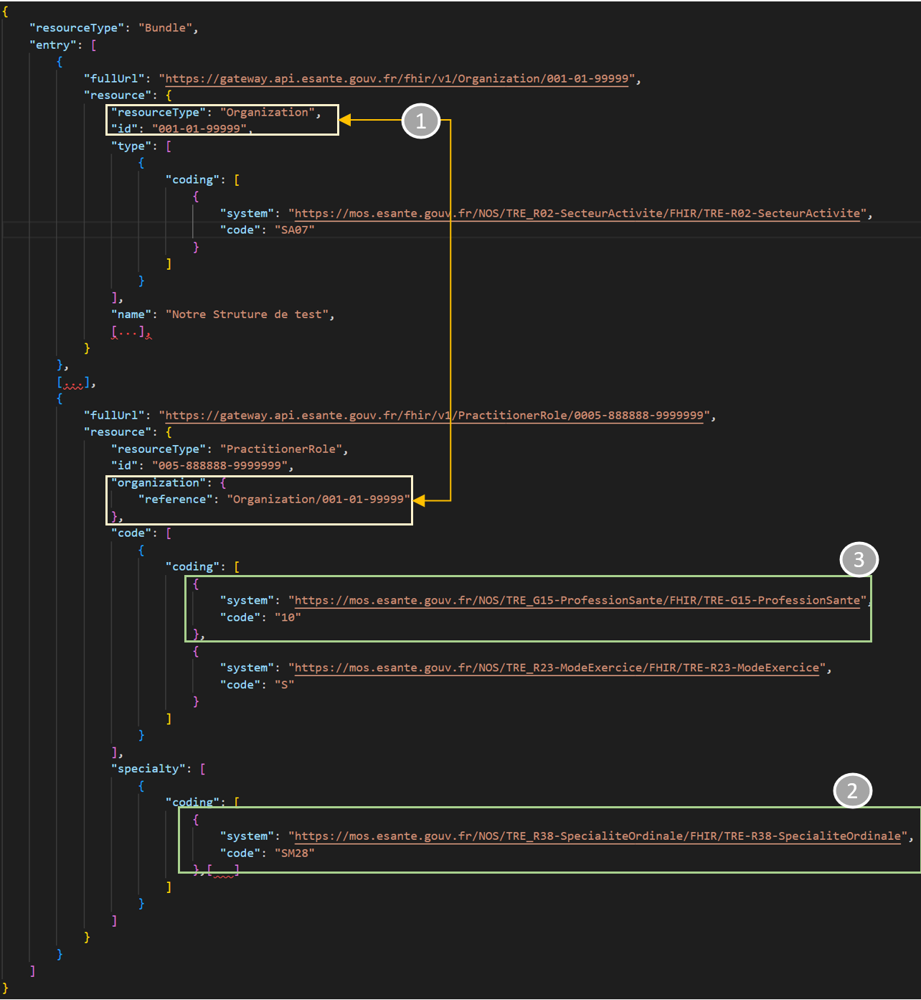

 
Le Ségur du numérique vise à développer le partage des données de santé entre les différents acteurs de la prise en charge et les patients, par le financement d’une mise à jour logicielle prise en charge par l’Etat pour favoriser l’augmentation des usages numériques dans les établissements. 

Les établissements de santé peuvent être accompagnés par les acteurs régionaux (ARS, GRADeS) dans leur déploiement, le pilotage de services socles nationaux et leur mise en conformité réglementaire.

Le Ségur du Numérique en Santé s’articule autour de 6 types de d'acteurs appelés couloirs. 
Nous allons vous détailler ci-dessous comment interroger l'API pour identifier les acteurs présents dans chaque couloir : [segurnumerique.sante-idf.fr](https://segurnumerique.sante-idf.fr/segur-et-services-socles/les-couloirs/).

### 1. Le couloir Médico-Social

Afin de récupérer les établissements médico-sociaux ayant un numéro finess, il faut interroger l'endpoint Organization.

Nous appliquerons deux filtres à la requête afin d'obtenir le résultat attendu :


<div class="wysiwyg" markdown="1">
 * la catégorie d'Organization parmi la liste ci-dessous (point 2 sur l'image ci-dessous)
 * l'Identifier : [finess.esante.gouv.fr](https://finess.esante.gouv.fr) (point 1 sur l'image ci-dessous)
</div>
<br/>

Liste des codes catégorie: 159, 166, 172, 175, 176, 177, 182, 183, 186, 188, 189, 190, 192, 194, 195, 196, 198, 202, 207, 221, 236, 238, 241, 246, 247, 249, 252, 253, 255, 286, 295, 344, 370, 377, 378, 379, 381, 382, 390, 395, 396, 402, 411, 418, 427, 437, 440, 441, 445, 446, 448, 449, 453, 500, 501, 502, 165, 178, 180, 197, 209, 213, 354, 460, 462, 608


{:style="max-width:670px"}

Pour information, ces codes font partie de la TRE [TRE-R66-CategorieEtablissement](https://mos.esante.gouv.fr/NOS/TRE_R66-CategorieEtablissement/FHIR/TRE-R66-CategorieEtablissement).


<div class="code-sample">
<div class="tab-content" data-name="Algorithmie">

1) Faire un appel sur le endpoint Organization en filtrant sur les Organization qui ont un identifier finess (&identifier=https://finess.esante.gouv.fr%7C) et qui ont une catégorie parmi la liste ci-dessus (&type=https://mos.esante.gouv.fr/NOS/TRE_R66-CategorieEtablissement/FHIR/TRE-R66-CategorieEtablissement%7C159&type=https://mos.esante.gouv.fr/NOS/TRE_R66-CategorieEtablissement/FHIR/TRE-R66-CategorieEtablissement%7C166 ...).
2) Répeter l'opération sur toutes les pages (1)

</div>
<div class="tab-content" data-name="curl">

curl -H "ESANTE-API-KEY: {{site.ans.demo_key }}" -X POST {{site.ans.api_url}}/fhir/Organization/_search -d 'type=https%3A%2F%2Fmos.esante.gouv.fr%2FNOS%2FTRE_R66-CategorieEtablissement%2FFHIR%2FTRE-R66-CategorieEtablissement%7C159%2Chttps%3A%2F%2Fmos.esante.gouv.fr%2FNOS%2FTRE_R66-CategorieEtablissement%2FFHIR%2FTRE-R66-CategorieEtablissement%7C165%2Chttps%3A%2F%2Fmos.esante.gouv.fr%2FNOS%2FTRE_R66-CategorieEtablissement%2FFHIR%2FTRE-R66-CategorieEtablissement%7C166%2Chttps%3A%2F%2Fmos.esante.gouv.fr%2FNOS%2FTRE_R66-CategorieEtablissement%2FFHIR%2FTRE-R66-CategorieEtablissement%7C172%2Chttps%3A%2F%2Fmos.esante.gouv.fr%2FNOS%2FTRE_R66-CategorieEtablissement%2FFHIR%2FTRE-R66-CategorieEtablissement%7C175%2Chttps%3A%2F%2Fmos.esante.gouv.fr%2FNOS%2FTRE_R66-CategorieEtablissement%2FFHIR%2FTRE-R66-CategorieEtablissement%7C176%2Chttps%3A%2F%2Fmos.esante.gouv.fr%2FNOS%2FTRE_R66-CategorieEtablissement%2FFHIR%2FTRE-R66-CategorieEtablissement%7C177%2Chttps%3A%2F%2Fmos.esante.gouv.fr%2FNOS%2FTRE_R66-CategorieEtablissement%2FFHIR%2FTRE-R66-CategorieEtablissement%7C178%2Chttps%3A%2F%2Fmos.esante.gouv.fr%2FNOS%2FTRE_R66-CategorieEtablissement%2FFHIR%2FTRE-R66-CategorieEtablissement%7C180%2Chttps%3A%2F%2Fmos.esante.gouv.fr%2FNOS%2FTRE_R66-CategorieEtablissement%2FFHIR%2FTRE-R66-CategorieEtablissement%7C182%2Chttps%3A%2F%2Fmos.esante.gouv.fr%2FNOS%2FTRE_R66-CategorieEtablissement%2FFHIR%2FTRE-R66-CategorieEtablissement%7C183%2Chttps%3A%2F%2Fmos.esante.gouv.fr%2FNOS%2FTRE_R66-CategorieEtablissement%2FFHIR%2FTRE-R66-CategorieEtablissement%7C186%2Chttps%3A%2F%2Fmos.esante.gouv.fr%2FNOS%2FTRE_R66-CategorieEtablissement%2FFHIR%2FTRE-R66-CategorieEtablissement%7C188%2Chttps%3A%2F%2Fmos.esante.gouv.fr%2FNOS%2FTRE_R66-CategorieEtablissement%2FFHIR%2FTRE-R66-CategorieEtablissement%7C189%2Chttps%3A%2F%2Fmos.esante.gouv.fr%2FNOS%2FTRE_R66-CategorieEtablissement%2FFHIR%2FTRE-R66-CategorieEtablissement%7C190%2Chttps%3A%2F%2Fmos.esante.gouv.fr%2FNOS%2FTRE_R66-CategorieEtablissement%2FFHIR%2FTRE-R66-CategorieEtablissement%7C192%2Chttps%3A%2F%2Fmos.esante.gouv.fr%2FNOS%2FTRE_R66-CategorieEtablissement%2FFHIR%2FTRE-R66-CategorieEtablissement%7C194%2Chttps%3A%2F%2Fmos.esante.gouv.fr%2FNOS%2FTRE_R66-CategorieEtablissement%2FFHIR%2FTRE-R66-CategorieEtablissement%7C195%2Chttps%3A%2F%2Fmos.esante.gouv.fr%2FNOS%2FTRE_R66-CategorieEtablissement%2FFHIR%2FTRE-R66-CategorieEtablissement%7C196%2Chttps%3A%2F%2Fmos.esante.gouv.fr%2FNOS%2FTRE_R66-CategorieEtablissement%2FFHIR%2FTRE-R66-CategorieEtablissement%7C197%2Chttps%3A%2F%2Fmos.esante.gouv.fr%2FNOS%2FTRE_R66-CategorieEtablissement%2FFHIR%2FTRE-R66-CategorieEtablissement%7C198%2Chttps%3A%2F%2Fmos.esante.gouv.fr%2FNOS%2FTRE_R66-CategorieEtablissement%2FFHIR%2FTRE-R66-CategorieEtablissement%7C202%2Chttps%3A%2F%2Fmos.esante.gouv.fr%2FNOS%2FTRE_R66-CategorieEtablissement%2FFHIR%2FTRE-R66-CategorieEtablissement%7C207%2Chttps%3A%2F%2Fmos.esante.gouv.fr%2FNOS%2FTRE_R66-CategorieEtablissement%2FFHIR%2FTRE-R66-CategorieEtablissement%7C209%2Chttps%3A%2F%2Fmos.esante.gouv.fr%2FNOS%2FTRE_R66-CategorieEtablissement%2FFHIR%2FTRE-R66-CategorieEtablissement%7C213%2Chttps%3A%2F%2Fmos.esante.gouv.fr%2FNOS%2FTRE_R66-CategorieEtablissement%2FFHIR%2FTRE-R66-CategorieEtablissement%7C221%2Chttps%3A%2F%2Fmos.esante.gouv.fr%2FNOS%2FTRE_R66-CategorieEtablissement%2FFHIR%2FTRE-R66-CategorieEtablissement%7C236%2Chttps%3A%2F%2Fmos.esante.gouv.fr%2FNOS%2FTRE_R66-CategorieEtablissement%2FFHIR%2FTRE-R66-CategorieEtablissement%7C238%2Chttps%3A%2F%2Fmos.esante.gouv.fr%2FNOS%2FTRE_R66-CategorieEtablissement%2FFHIR%2FTRE-R66-CategorieEtablissement%7C241%2Chttps%3A%2F%2Fmos.esante.gouv.fr%2FNOS%2FTRE_R66-CategorieEtablissement%2FFHIR%2FTRE-R66-CategorieEtablissement%7C246%2Chttps%3A%2F%2Fmos.esante.gouv.fr%2FNOS%2FTRE_R66-CategorieEtablissement%2FFHIR%2FTRE-R66-CategorieEtablissement%7C247%2Chttps%3A%2F%2Fmos.esante.gouv.fr%2FNOS%2FTRE_R66-CategorieEtablissement%2FFHIR%2FTRE-R66-CategorieEtablissement%7C249%2Chttps%3A%2F%2Fmos.esante.gouv.fr%2FNOS%2FTRE_R66-CategorieEtablissement%2FFHIR%2FTRE-R66-CategorieEtablissement%7C252%2Chttps%3A%2F%2Fmos.esante.gouv.fr%2FNOS%2FTRE_R66-CategorieEtablissement%2FFHIR%2FTRE-R66-CategorieEtablissement%7C253%2Chttps%3A%2F%2Fmos.esante.gouv.fr%2FNOS%2FTRE_R66-CategorieEtablissement%2FFHIR%2FTRE-R66-CategorieEtablissement%7C255%2Chttps%3A%2F%2Fmos.esante.gouv.fr%2FNOS%2FTRE_R66-CategorieEtablissement%2FFHIR%2FTRE-R66-CategorieEtablissement%7C286%2Chttps%3A%2F%2Fmos.esante.gouv.fr%2FNOS%2FTRE_R66-CategorieEtablissement%2FFHIR%2FTRE-R66-CategorieEtablissement%7C295%2Chttps%3A%2F%2Fmos.esante.gouv.fr%2FNOS%2FTRE_R66-CategorieEtablissement%2FFHIR%2FTRE-R66-CategorieEtablissement%7C344%2Chttps%3A%2F%2Fmos.esante.gouv.fr%2FNOS%2FTRE_R66-CategorieEtablissement%2FFHIR%2FTRE-R66-CategorieEtablissement%7C354%2Chttps%3A%2F%2Fmos.esante.gouv.fr%2FNOS%2FTRE_R66-CategorieEtablissement%2FFHIR%2FTRE-R66-CategorieEtablissement%7C370%2Chttps%3A%2F%2Fmos.esante.gouv.fr%2FNOS%2FTRE_R66-CategorieEtablissement%2FFHIR%2FTRE-R66-CategorieEtablissement%7C377%2Chttps%3A%2F%2Fmos.esante.gouv.fr%2FNOS%2FTRE_R66-CategorieEtablissement%2FFHIR%2FTRE-R66-CategorieEtablissement%7C378%2Chttps%3A%2F%2Fmos.esante.gouv.fr%2FNOS%2FTRE_R66-CategorieEtablissement%2FFHIR%2FTRE-R66-CategorieEtablissement%7C379%2Chttps%3A%2F%2Fmos.esante.gouv.fr%2FNOS%2FTRE_R66-CategorieEtablissement%2FFHIR%2FTRE-R66-CategorieEtablissement%7C381%2Chttps%3A%2F%2Fmos.esante.gouv.fr%2FNOS%2FTRE_R66-CategorieEtablissement%2FFHIR%2FTRE-R66-CategorieEtablissement%7C382%2Chttps%3A%2F%2Fmos.esante.gouv.fr%2FNOS%2FTRE_R66-CategorieEtablissement%2FFHIR%2FTRE-R66-CategorieEtablissement%7C390%2Chttps%3A%2F%2Fmos.esante.gouv.fr%2FNOS%2FTRE_R66-CategorieEtablissement%2FFHIR%2FTRE-R66-CategorieEtablissement%7C395%2Chttps%3A%2F%2Fmos.esante.gouv.fr%2FNOS%2FTRE_R66-CategorieEtablissement%2FFHIR%2FTRE-R66-CategorieEtablissement%7C396%2Chttps%3A%2F%2Fmos.esante.gouv.fr%2FNOS%2FTRE_R66-CategorieEtablissement%2FFHIR%2FTRE-R66-CategorieEtablissement%7C402%2Chttps%3A%2F%2Fmos.esante.gouv.fr%2FNOS%2FTRE_R66-CategorieEtablissement%2FFHIR%2FTRE-R66-CategorieEtablissement%7C411%2Chttps%3A%2F%2Fmos.esante.gouv.fr%2FNOS%2FTRE_R66-CategorieEtablissement%2FFHIR%2FTRE-R66-CategorieEtablissement%7C418%2Chttps%3A%2F%2Fmos.esante.gouv.fr%2FNOS%2FTRE_R66-CategorieEtablissement%2FFHIR%2FTRE-R66-CategorieEtablissement%7C427%2Chttps%3A%2F%2Fmos.esante.gouv.fr%2FNOS%2FTRE_R66-CategorieEtablissement%2FFHIR%2FTRE-R66-CategorieEtablissement%7C437%2Chttps%3A%2F%2Fmos.esante.gouv.fr%2FNOS%2FTRE_R66-CategorieEtablissement%2FFHIR%2FTRE-R66-CategorieEtablissement%7C440%2Chttps%3A%2F%2Fmos.esante.gouv.fr%2FNOS%2FTRE_R66-CategorieEtablissement%2FFHIR%2FTRE-R66-CategorieEtablissement%7C441%2Chttps%3A%2F%2Fmos.esante.gouv.fr%2FNOS%2FTRE_R66-CategorieEtablissement%2FFHIR%2FTRE-R66-CategorieEtablissement%7C445%2Chttps%3A%2F%2Fmos.esante.gouv.fr%2FNOS%2FTRE_R66-CategorieEtablissement%2FFHIR%2FTRE-R66-CategorieEtablissement%7C446%2Chttps%3A%2F%2Fmos.esante.gouv.fr%2FNOS%2FTRE_R66-CategorieEtablissement%2FFHIR%2FTRE-R66-CategorieEtablissement%7C448%2Chttps%3A%2F%2Fmos.esante.gouv.fr%2FNOS%2FTRE_R66-CategorieEtablissement%2FFHIR%2FTRE-R66-CategorieEtablissement%7C449%2Chttps%3A%2F%2Fmos.esante.gouv.fr%2FNOS%2FTRE_R66-CategorieEtablissement%2FFHIR%2FTRE-R66-CategorieEtablissement%7C453%2Chttps%3A%2F%2Fmos.esante.gouv.fr%2FNOS%2FTRE_R66-CategorieEtablissement%2FFHIR%2FTRE-R66-CategorieEtablissement%7C460%2Chttps%3A%2F%2Fmos.esante.gouv.fr%2FNOS%2FTRE_R66-CategorieEtablissement%2FFHIR%2FTRE-R66-CategorieEtablissement%7C462%2Chttps%3A%2F%2Fmos.esante.gouv.fr%2FNOS%2FTRE_R66-CategorieEtablissement%2FFHIR%2FTRE-R66-CategorieEtablissement%7C500%2Chttps%3A%2F%2Fmos.esante.gouv.fr%2FNOS%2FTRE_R66-CategorieEtablissement%2FFHIR%2FTRE-R66-CategorieEtablissement%7C501%2Chttps%3A%2F%2Fmos.esante.gouv.fr%2FNOS%2FTRE_R66-CategorieEtablissement%2FFHIR%2FTRE-R66-CategorieEtablissement%7C502%2Chttps%3A%2F%2Fmos.esante.gouv.fr%2FNOS%2FTRE_R66-CategorieEtablissement%2FFHIR%2FTRE-R66-CategorieEtablissement%7C608&identifier=https%3A%2F%2Ffiness.esante.gouv.fr%7C'
      

</div>
<div class="tab-content" data-name="java">

var client = createClient();

// construct category search clause
var codes = Arrays.asList("159","165","166","172","175","176","177", "178","180","182","183","186","188","189","190","192","194","195","196","197","198","202","207","209","213","221","236","238","241","246","247","249","252","253","255","286","295","344","354","370","377","378","379","381","382","390","395","396","402","411","418","427","437","440","441","445","446","448","449","453","460","462","500","501","502","608");
var activityClause = Organization.TYPE.exactly()
        .systemAndValues("https://mos.esante.gouv.fr/NOS/TRE_R66-CategorieEtablissement/FHIR/TRE-R66-CategorieEtablissement", codes);

// construct identifier search clause
var identifierClause = Organization.IDENTIFIER.hasSystemWithAnyCode("https://finess.esante.gouv.fr");

// create and execute request
var bundle = client
        .search()
        .forResource(Organization.class)
        .where(activityClause)
        .and(identifierClause)
        .returnBundle(Bundle.class)
        .execute();

var hasNext = true;
var finessOrganizations = new LinkedList<>();

// for each page
do {
    logger.info("Total result {}", bundle.getTotal());

    // extract data from bundle
    finessOrganizations.add(bundle.getEntry());

    if (bundle.getLink("next") != null) {
        // get the next page
        bundle = client
                .loadPage()
                .byUrl(bundle.getLink("next").getUrl())
                .andReturnBundle(Bundle.class)
                .execute();
    } else {
        hasNext = false;
    }
} while(hasNext);

</div>

</div>

Le résultat retourné est un Bundle contenant la première page de résultat. Il contient aussi le nombre total d'éléments retournés par la requête qui peuvent être récupérés sur les pages suivantes.


### 2. Le couloir Hôpital

Afin de récupérer les établissements sanitaires, nous devons interroger l'endpoint de recherche transactionnel en deux étapes :
<div class="wysiwyg" markdown="1">
 * Récupérer les établissements sanitaires (champs 1 dans l'image ci-dessous)
 * Vérifier que le type de l'établissement ne correspond pas à un établissement médico-social (champs 2 dans l'image ci-dessous)
</div>

<br />


Liste des secteurs d'activité: SA01;SA02;SA03;SA04;SA30;SA34;SA36


{:style="max-width:670px"}


Note : La liste des codes des établissements sanitaires (ex: SA01, SA02, etc...) se situe dans le référentiel : [TRE-R02-SecteurActivite](https://mos.esante.gouv.fr/NOS/TRE_R02-SecteurActivite/FHIR/TRE-R02-SecteurActivite/)


<div class="code-sample">
<div class="tab-content" data-name="Algorithmie">

1) Faire un appel sur le endpoint Organization en filtrant sur les Organization qui ont un secteur d'activité parmi la liste ci-dessus (&type=https://mos.esante.gouv.fr/NOS/TRE_R02-SecteurActivite/FHIR/TRE-R02-SecteurActivite/%7CSA01&type=https://mos.esante.gouv.fr/NOS/TRE_R02-SecteurActivite/FHIR/TRE-R02-SecteurActivite/%7CSA02 ...).
2) Vérifier que pour chaque établissement, son type n'est pas présent dans la liste des catégories "médico-sociaux" (voir la liste dans le use case précédent). 
3) Répeter l'opération sur toutes les pages (1)

</div>
<div class="tab-content" data-name="curl">

curl -H "ESANTE-API-KEY: {{site.ans.demo_key }}" "{{site.ans.api_url}}/fhir/v1?_getpages=b109ca26-32eb-416f-8c8a-fee6c6597bb9&_pageId=lZg9MO8QrAVQZoT5uxjWir7vNAEr7AGfqD_nysfrz5wl53MhYmudRGTxjJfwUVMYuYOdvQq4OASgzZbCGJjhb7EH19BN-GH2uG5r5q9ZT680D729MuB8AQowHOP0m-nlaq5JQ3eWKdOAc4z6ZlPQSKRIa2LDXto2BFdF4cEs2TVtK1uJsLVSBVq6JJElmJv5vrd0wkQaaf9H5HNBJG_W1g4gIxbflOSdm8MMyIAvA_Jm6tKvrcC9kFA5Rqn0_FawrKQJbmA2hi0ZbTJaZmaNHJSRA05shFi4vQMBSL0jqs1vo3bZCgFquO5qHyghvwrqmanzRhMjWzSGwanYS4jdpuScMd-btLsRIobeF9bNhGS3bcAVcS3a6SuUkya1H-nfd5XP957ZzPFP-hPsjHuSk4oXbbxYirHZFaKHMrdM3dmXbOdHzPsbgxA9-6RhJgwtlXzOuBToLIQ9VPQrL5F1Z0VeDkpHN50pG445m9Y6zL-YmKruLhsEvfnW0f3PgDKnIUZsFQNMmTetD7vRMlfxiPBws5J7d0HJB1WFG-Qk0n6q6hW4PStx9lsvmSS5Ggkg5At7ko005tiVj50SjbvTz9Bgj-4MfVHpmzY5og8avqHwci6Vo4iE57W4QaGuEQFKkFp2aDF6kBpY8SmKAbYGS08NjjiXqHSpsaj0PxGaS5NMX0vf69eQSd1X8HVQtFlbZubcKQs-F3wrZwp4J9a_Tfhd913wZB5wDHA1C226GfnhFQ5jx2BilMUjw-sVDb-_RmWsDYPG&_bundletype=searchset"

</div>
<div class="tab-content" data-name="java">

var client = createClient();

// hospital:
var bHospital = client.search().forResource(Organization.class)
        .where(Organization.TYPE.exactly().codes("SA01","SA02","SA03","SA04","SA30","SA34","SA36"))
        .returnBundle(Bundle.class).execute();
var totalHospital = bHospital.getTotal();
var typesAsStringList = Arrays.asList("159","165","166","172","175","176","177", "178","180","182","183","186","188","189","190","192","194","195","196","197","198","202","207","209","213","221","236","238","241","246","247","249","252","253","255","286","295","344","354","370","377","378","379","381","382","390","395","396","402","411","418","427","437","440","441","445","446","448","449","453","460","462","500","501","502");
var goodElements = new ArrayList<>();
var hasNext = true;
var treated = 0;

logger.info("Total results - {}", bHospital.getTotal());

do {
    var bundleContent = bHospital.getEntry();
    logger.info("Treat {} entry(ies)", bundleContent.size());

    for (var e : bundleContent) {
        var org = (Organization) e.getResource();
        var isHospital = true;

        // check hospital system & code
        for (var type : org.getType()) {
            for (var coding : type.getCoding()) {
                if ("https://mos.esante.gouv.fr/NOS/TRE_R66-CategorieEtablissement/FHIR/TRE-R66-CategorieEtablissement".equals(coding.getSystem()) &&
                        typesAsStringList.contains(coding.getCode())) {
                    isHospital = false;
                    break;
                }
            }
        }

        // filter good elements
        if(isHospital) {
            goodElements.add(org);
        }
    }

    // check if result has a next page
    if (bHospital.getLink("next")!=null) {
        bHospital = client.loadPage().byUrl(bHospital.getLink("next").getUrl()).andReturnBundle(Bundle.class).execute();
    } else {
        hasNext = false;
    }

    treated += bundleContent.size();
    logger.info("Progress treated - {} / {}", treated, bHospital.getTotal());
} while (hasNext);

logger.info("Total global - {}", totalHospital);
logger.info("Total Hospital - {}", goodElements.size());

</div>

</div>

L'exécution de l'exemple de code peut donner un résultat équivalent :

```bash
Progress treated - 11650 / 11722
Treat 50 entry(ies)
Progress treated - 11700 / 11722
Treat 22 entry(ies)
Progress treated - 11722 / 11722
Total global - 11722
Total Hospital - 11722
```
<br />

### 3. Le couloir Biologie Médicale

Afin de récupérer les établissements de biologie ayant des médecins ou pharmaciens exerçants, nous devons interroger l'endpoint Organization :
<div class="wysiwyg" markdown="1">
 * En filtrant sur les types d'établissements : SA25, SA29
 * En incluant les PractitionerRoles liés aux Organizations afin de pouvoir filtrer sur le code profession de l'activité du professionel (PractitionerRole)
</div>

<br />

Une fois l'ensemble des données récupéré, il faut regrouper les PractitionerRoles pour les lier aux bonnes Organizations (champ organization du PractitionerRole comme le montre le point 1 sur l'image ci-dessous)

Nous pouvons finalement ne récupérer que les Organizations contenant des PractitionerRoles qui correspondent aux filtres Secteur d'activité et Profession santé (champs montré sur le point 2 de l'image ci-dessous).


{:style="max-width:670px"}


Note : La liste des codes des établissements sanitaires (ex: SA25, etc...) se situe dans le référentiel : [TRE-R02-SecteurActivite](https://mos.esante.gouv.fr/NOS/TRE_R02-SecteurActivite/FHIR/TRE-R02-SecteurActivite/). Les Roles souhaités (10 et 21) sont disponibles dans le référentiel [TRE-G15-ProfessionSante](https://mos.esante.gouv.fr/NOS/TRE_G15-ProfessionSante/FHIR/TRE-G15-ProfessionSante)


<div class="code-sample">
<div class="tab-content" data-name="Algorithmie">

1) Faire un appel sur le endpoint Organization en filtrant sur les Organization qui ont un type SA25 ou SA29 (&type=SA25,SA29). Cet appel devra inclure les PractitionerRoles attachés (&_revinclude=PractitionerRole:organization)
2) Pour chacun des PractitionerRole retourné, vérifier il y a au moins 1 role (champs code) avec pour système "https://mos.esante.gouv.fr/NOS/TRE_G15-ProfessionSante/FHIR/TRE-G15-ProfessionSante" et un code associé à 10 (médecin) ou 21 (pharmacien)
3) Pour chacun des PractitionerRole trouvé, récupérer les Organization qui ont le même id que le champs organization du PractitionerRole
4) Répeter l'opération sur toutes les pages (1)

</div>
<div class="tab-content" data-name="curl">

curl -H "ESANTE-API-KEY: {{site.ans.demo_key }}" "{{site.ans.api_url}}/fhir/Organization?type=SA25%2CSA29&_revinclude=PractitionerRole%3Aorganization"

</div>
<div class="tab-content" data-name="java">

var client = createClient();

// construct biology facility request
var orgBundle = client.search().forResource(Organization.class)
        .where(Organization.TYPE.exactly().codes("SA25","SA29"))
        .revInclude(PractitionerRole.INCLUDE_ORGANIZATION)
        .returnBundle(Bundle.class).execute();

var totalElements = orgBundle.getTotal();
var goodElements = new ArrayList<>();
var hasNext = true;
var treated = 0;

logger.info("Total results - {}", orgBundle.getTotal());

do {
    var bundleContent = orgBundle.getEntry();
    var organizationMap = new LinkedHashMap<String, Organization>();

    for (var e : bundleContent) {
        // store the organization inside a map
        if(e.getResource() instanceof Organization) {
            var org = (Organization) e.getResource();
            organizationMap.put(org.getId(), org);
        }

        if(e.getResource() instanceof PractitionerRole) {
            var role = (PractitionerRole) e.getResource();
            var medicOrPharmacist = false;

            // check if the Role contains a medic or pharmacist code
            for(var code : role.getCode()) {
                for(var coding : code.getCoding()) {
                    if (coding.getSystem().equals("https://mos.esante.gouv.fr/NOS/TRE_G15-ProfessionSante/FHIR/TRE-G15-ProfessionSante") &&
                            (coding.getCode().equals("10") || coding.getCode().equals("21"))) {
                        medicOrPharmacist = true;
                        break;
                    }
                }
            }

            // if the Role is right and still practicing, link it to the right Organization
            if(medicOrPharmacist && !role.getPeriod().hasEnd() && role.getOrganization() != null) {
                var org = (Organization) role.getOrganization().getResource();

                if(organizationMap.containsKey(org.getId())) {
                    organizationMap.get(org.getId()).addContained(role);
                }
            }
        }
    }

    // loop over Organization and keep only those with roles
    for(var org : organizationMap.values()) {
        logger.info("Organization has {} roles", org.getContained().size());
        if(org.getContained().size() > 0) {
            goodElements.add(org);
        }
    }

    // check if result has a next page
    if (orgBundle.getLink("next")!=null) {
        orgBundle = client.loadPage().byUrl(orgBundle.getLink("next").getUrl()).andReturnBundle(Bundle.class).execute();
    } else {
        hasNext = false;
    }

    treated += bundleContent.size();
} while (hasNext);

logger.info("Total global - {}", totalElements);
logger.info("Total filtered - {}", goodElements.size());

</div>

</div>

L'exécution de l'exemple de code peut donner un résultat équivalent :

```bash
Organization has 14 roles
Organization has 0 roles
Total global - 4312
Total filtered - 523
```
<br />


### 4. Le couloir Radiologie

Afin de récupérer les établissements de radiologie, nous devons interroger l'endpoint Organization :
<div class="wysiwyg" markdown="1">
 * En filtrant sur les types d'établissements : SA07, SA08, SA09
 * En incluant les PractitionerRole liés aux Organizations afin de pouvoir filtrer ensuite sur le savoir-faire des PractitionerRole
</div>

<br />


Une fois l’ensemble des données récupéré, procédez aux filtres suivant : 

Les PractitionerRoles doivent correspondre à la profession de santé "Médecin" (10) (champs code du PractitionerRole comme le montre le point 3 sur l'image ci-dessous).

Ensuite les PractitionerRoles souhaités doivent correspondre à certaines spécialités : SM28, SM44, SM45, SM55 (champs specialty du PractitionerRole comme le montre le point 2 sur l'image ci-dessous).

Enfin, faut regrouper les PractitionerRoles pour les lier aux bonnes Organizations (champ organization du PractitionerRole comme le montre le point 1 sur l’image ci-dessous)


Nous pouvons finalement ne récupérer que les Organizations contenant des PractitionerRoleRoles selon les filtres que nous avons appliqués.


{:style="max-width:670px"}


Note: la liste des codes des établissements sanitaires (ex: SA07, etc...) se situe dans le référentiel : [TRE-R02-SecteurActivite](https://mos.esante.gouv.fr/NOS/TRE_R02-SecteurActivite/FHIR/TRE-R02-SecteurActivite/). La liste des profession est disponible dans le référentiel [TRE-G15-ProfessionSante](https://mos.esante.gouv.fr/NOS/TRE_G15-ProfessionSante/FHIR/TRE-G15-ProfessionSante). La liste des code spécialités est disponibles dans le référentiel [TRE_R38-SpecialiteOrdinale](https://mos.esante.gouv.fr/NOS/TRE_R38-SpecialiteOrdinale/FHIR/TRE-R38-SpecialiteOrdinale)


<div class="code-sample">
<div class="tab-content" data-name="Algorithmie">

1) Faire un appel sur l'endpoint Organization en filtrant sur les Organization qui ont un type SA07, SA08 ou SA0 (&type=SA07,SA08,SA09). Cet appel devra inclure les PractitionerRoles attachés (&_revinclude=PractitionerRole:organization)
2) Pour chacun des PractitionerRole retournés, vérifier qu'il y a au moins 1 Role (champs role) avec pour système "https://mos.esante.gouv.fr/NOS/TRE_G15-ProfessionSante/FHIR/TRE-G15-ProfessionSante" et un code associé à 10 (médecin)
3) Pour chacun des PractitionerRole filtrés, vérifier qu'il y a au moins 1 Spécialité (champs speciality) avec pour système "https://mos.esante.gouv.fr/NOS/TRE_R38-SpecialiteOrdinale/FHIR/TRE-R38-SpecialiteOrdinale" et un code associé SM28, SM44, SM45 ou SM55
4) Pour chacun des PractitionerRole trouvés et filtrés, récupérer les Organization qui ont le même id que le champs organization du PractitionerRole
5) Répeter l'opération sur toutes les pages (1)

</div>
<div class="tab-content" data-name="curl">

curl -H "ESANTE-API-KEY: {{site.ans.demo_key }}" "{{site.ans.api_url}}/fhir/Organization?type=SA07%2CSA08%2CSA09&_revinclude=PractitionerRole%3Aorganization"

</div>
<div class="tab-content" data-name="java">

var client = createClient();
var hasNext = true;
Bundle orgBundle = null;
var totalElements = 0;
var goodElements = new ArrayList<>();
var treated = 0;
var nbRoles = 0;

// construct radiology facility request
try {
orgBundle = client.search().forResource(Organization.class)
.where(Organization.TYPE.exactly().codes("SA07", "SA08", "SA09"))
.revInclude(PractitionerRole.INCLUDE_ORGANIZATION)
.returnBundle(Bundle.class).execute();

    totalElements = orgBundle.getTotal();
} catch (Exception e) {
e.printStackTrace();
hasNext = false;
}

logger.info("Total results - {}", orgBundle.getTotal());

do {
var bundleContent = orgBundle.getEntry();
var organizationMap = new LinkedHashMap<String, Organization>();

    for (var e : bundleContent) {
        // store the organization inside a map
        if(e.getResource() instanceof Organization) {
            var org = (Organization) e.getResource();
            organizationMap.put(org.getId(), org);
            treated++;
        }

        if(e.getResource() instanceof PractitionerRole) {
            var role = (PractitionerRole) e.getResource();
            var medic = false;
            var radiologist = false;

            nbRoles++;

            // check if the Role contains a medic
            for(var code : role.getCode()) {
                for(var coding : code.getCoding()) {
                    if (coding.getSystem().equals("https://mos.esante.gouv.fr/NOS/TRE_G15-ProfessionSante/FHIR/TRE-G15-ProfessionSante") &&
                            coding.getCode().equals("10")) {
                        medic = true;
                        break;
                    }
                }
            }

            if(medic) {
                var specialtyStringList = Arrays.asList("SM28", "SM44", "SM45", "SM55");

                // if a medic was found, check its specialties to filter only radiologist
                for (var code : role.getSpecialty()) {
                    for (var coding : code.getCoding()) {
                        logger.info("Specialty Coding {} - {}", coding.getSystem(), coding.getCode());
                        if (coding.getSystem().equals("https://mos.esante.gouv.fr/NOS/TRE_R38-SpecialiteOrdinale/FHIR/TRE-R38-SpecialiteOrdinale") &&
                                specialtyStringList.contains(coding.getCode())) {
                            radiologist = true;
                            break;
                        }
                    }
                }
            }

            // if the Role is right and still practicing, link it to the right Organization
            if(radiologist && !role.getPeriod().hasEnd() && role.getOrganization() != null) {
                var org = (Organization) role.getOrganization().getResource();

                if(organizationMap.containsKey(org.getId())) {
                    organizationMap.get(org.getId()).addContained(role);
                }
            }
        }
    }

    // loop over Organization and keep only those with roles
    for(var org : organizationMap.values()) {
        if(!org.getContained().isEmpty()) {
            goodElements.add(org);
        }
    }

    // check if result has a next page
    if (orgBundle.getLink("next")!=null) {
        try {
            orgBundle = client.loadPage().byUrl(orgBundle.getLink("next").getUrl()).andReturnBundle(Bundle.class).execute();
        } catch (Exception e) {
            logger.error("Error getting next page");
            e.printStackTrace();
            hasNext = false;
        }
    } else {
        hasNext = false;
    }

    logger.info("Progress treated - {} / {} / {} role(s)", treated, orgBundle.getTotal(), nbRoles);
} while (hasNext);

logger.info("Total organization - {}", totalElements);
logger.info("Total radiology  - {}", goodElements.size());

</div>

</div>

L'exécution de l'exemple de code peut donner un résultat équivalent :

```bash
Progress treated 466000  / 466040 / 445524 role(s)
Progress treated 466040  / 466040 / 445562 role(s)
Total global - 466040
Total filtered - 0
```

<br />


### 5. Le couloir Médecine de ville

Afin de récupérer les établissements de médecine de ville qui ne sont pas des cabinets de radiologie, nous devons interroger l'endpoint Organization :
<div class="wysiwyg" markdown="1">
 * En filtrant sur les types d'établissements : SA05, SA07, SA08, SA09, SA52
 * En incluant les PractitionerRole liés aux Organizations afin de pouvoir filtrer ensuite sur le savoir-faire des Practitioner
</div>

<br />

Une fois l’ensemble des données récupéré, procédez aux filtres suivant : 

Les PractitionerRoles doivent correspondre à la profession de santé "Médecin" (10) (champs code du PractitionerRole comme le montre le point 3 sur l'image ci-dessous).

Ensuite les PractitionerRoles souhaités ***NE DOIVENT PAS correspondre*** à certaines spécialités : SM28, SM44, SM45, SM55 (champs specialty du PractitionerRole comme le montre le point 2 sur l'image ci-dessous)

Enfin, faut regrouper les PractitionerRoles pour les lier aux bonnes Organizations (champ organization du PractitionerRole comme le montre le point 1 sur l’image ci-dessous)


Puis les Roles souhaités ne doivent pas correspondre à certaines spécialités (SM28, SM44, SM45, SM55), disponibles dans le référentiel [TRE_R38-SpecialiteOrdinale](https://mos.esante.gouv.fr/NOS/TRE_R38-SpecialiteOrdinale/FHIR/TRE-R38-SpecialiteOrdinale)


Nous pouvons finalement ne récupérer que les Organizations contenant des PractitionerRoleRoles selon les filtres que nous avons appliqués.


{:style="max-width:670px"}


<div class="code-sample">
<div class="tab-content" data-name="Algorithmie">

1) Faire un appel sur l'endpoint Organization en filtrant sur les Organization qui ont un type SA07, SA08 ou SA0 (&type=SA07,SA08,SA09). Cet appel devra inclure les PractitionerRoles attachés (&_revinclude=PractitionerRole:organization)
2) Pour chacun des PractitionerRole retournés, vérifier qu'il y a au moins 1 Role (champs role) avec pour système "https://mos.esante.gouv.fr/NOS/TRE_G15-ProfessionSante/FHIR/TRE-G15-ProfessionSante" et un code associé à 10 (médecin)
3) Pour chacun des PractitionerRole filtrés, vérifier qu'il ne dispose pas des spécialités de radiologie (champs speciality) avec pour système "https://mos.esante.gouv.fr/NOS/TRE_R38-SpecialiteOrdinale/FHIR/TRE-R38-SpecialiteOrdinale" et un code associé SM28, SM44, SM45 ou SM55
4) Pour chacun des PractitionerRole filtrés, vérifier qu'il est toujours en activité
5) Pour chacun des PractitionerRole trouvés et filtrés, récupérer les Organization qui ont le même id que le champs organization du PractitionerRole
6) Répeter l'opération sur toutes les pages (1)

</div>
<div class="tab-content" data-name="curl">

curl -H "ESANTE-API-KEY: {{site.ans.demo_key }}" "{{site.ans.api_url}}/fhir/Organization?type=SA05%2CSA07%2CSA08%2CSA09%2CSA52&_revinclude=PractitionerRole%3Aorganization"

</div>
<div class="tab-content" data-name="java">

var client = createClient();
var hasNext = true;
Bundle orgBundle = null;
var totalElements = 0;
var goodElements = new ArrayList<>();
var treated = 0;
var nbRoles = 0;

// construct radiology facility request
try {
orgBundle = client.search().forResource(Organization.class)
.where(Organization.TYPE.exactly().codes("SA05", "SA07", "SA08", "SA09", "SA52"))
.revInclude(PractitionerRole.INCLUDE_ORGANIZATION)
.returnBundle(Bundle.class).execute();

    totalElements = orgBundle.getTotal();
} catch (Exception e) {
e.printStackTrace();
hasNext = false;
}

logger.info("Total results - {}", orgBundle.getTotal());

do {
var bundleContent = orgBundle.getEntry();
var organizationMap = new LinkedHashMap<String, Organization>();

    for (var e : bundleContent) {
        // store the organization inside a map
        if(e.getResource() instanceof Organization) {
            var org = (Organization) e.getResource();
            organizationMap.put(org.getId(), org);
            treated++;
        }

        if(e.getResource() instanceof PractitionerRole) {
            var role = (PractitionerRole) e.getResource();
            var medic = false;
            var radiologist = false;

            nbRoles++;

            // check if the Role contains a medic
            for(var code : role.getCode()) {
                for(var coding : code.getCoding()) {
                    if (coding.getSystem().equals("https://mos.esante.gouv.fr/NOS/TRE_G15-ProfessionSante/FHIR/TRE-G15-ProfessionSante") &&
                            coding.getCode().equals("10")) {
                        medic = true;
                        break;
                    }
                }
            }

            if(medic) {
                var specialtyStringList = Arrays.asList("SM28", "SM44", "SM45", "SM55");

                // if a medic was found, check its specialties to filter only radiologist
                for (var code : role.getSpecialty()) {
                    for (var coding : code.getCoding()) {
                        logger.info("Specialty Coding {} - {}", coding.getSystem(), coding.getCode());
                        if (coding.getSystem().equals("https://mos.esante.gouv.fr/NOS/TRE_R38-SpecialiteOrdinale/FHIR/TRE-R38-SpecialiteOrdinale") &&
                                specialtyStringList.contains(coding.getCode())) {
                            radiologist = true;
                            break;
                        }
                    }
                }
            }

            // if the Role is right and still practicing, link it to the right Organization
            if(medic && !radiologist && !role.getPeriod().hasEnd() && role.getOrganization() != null) {
                var org = (Organization) role.getOrganization().getResource();

                if(organizationMap.containsKey(org.getId())) {
                    organizationMap.get(org.getId()).addContained(role);
                }
            }
        }
    }

    // loop over Organization and keep only those with roles
    for(var org : organizationMap.values()) {
        if(!org.getContained().isEmpty()) {
            goodElements.add(org);
        }
    }

    // check if result has a next page
    if (orgBundle.getLink("next")!=null) {
        try {
            orgBundle = client.loadPage().byUrl(orgBundle.getLink("next").getUrl()).andReturnBundle(Bundle.class).execute();
        } catch (Exception e) {
            logger.error("Error getting next page");
            e.printStackTrace();
            hasNext = false;
        }
    } else {
        hasNext = false;
    }

    logger.info("Progress treated - {} / {} / {} role(s)", treated, orgBundle.getTotal(), nbRoles);
} while (hasNext);

logger.info("Total organization - {}", totalElements);
logger.info("Total radiology  - {}", goodElements.size());

</div>

</div>

L'exécution de l'exemple de code peut donner un résultat équivalent :

```bash
Progress treated 472050  / 472077 / 454524 role(s)
Progress treated 472077  / 472077 / 454561 role(s)
Total global - 466040
Total filtered - 0
```

<br />


### 6. Le couloir Pharmacie

Afin de récupérer les officines de pharmacie, nous devons interroger l'endpoint Organization :
<div class="wysiwyg" markdown="1">
 * En filtrant sur le système et les types d'établissements : https://mos.esante.gouv.fr/NOS/TRE_R02-SecteurActivite/FHIR/TRE-R02-SecteurActivite, SA33, SA38, SA39, SA56
</div>

<br />
La liste des codes des pharmacies (ex: SA33, etc...) se trouve dans le référentiel : [TRE-R02-SecteurActivite](https://mos.esante.gouv.fr/NOS/TRE_R02-SecteurActivite/FHIR/TRE-R02-SecteurActivite/)

Les données récupérées sont déjà pré-filtrées selon notre besoin et ne sont que des pharmacies.


<div class="code-sample">
<div class="tab-content" data-name="Algorithmie">

1) Faire un appel sur l'endpoint Organization en filtrant sur les Organization qui ont un type SA33, SA38, SA39 ou SA56. Cet appel devra également inclure le filtre sur le système (ex : type=https%3A%2F%2Fmos.esante.gouv.fr%2FNOS%2FTRE_R02-SecteurActivite%2FFHIR%2FTRE-R02-SecteurActivite|SA33)
2) L'ensembles des Organization récupérées sont des pharmacies

</div>
<div class="tab-content" data-name="curl">

curl -H "ESANTE-API-KEY: {{site.ans.demo_key }}" "{{site.ans.api_url}}/fhir/Organization?type=https%3A%2F%2Fmos.esante.gouv.fr%2FNOS%2FTRE_R02-SecteurActivite%2FFHIR%2FTRE-R02-SecteurActivite%7CSA33%2Chttps%3A%2F%2Fmos.esante.gouv.fr%2FNOS%2FTRE_R02-SecteurActivite%2FFHIR%2FTRE-R02-SecteurActivite%7CSA38%2Chttps%3A%2F%2Fmos.esante.gouv.fr%2FNOS%2FTRE_R02-SecteurActivite%2FFHIR%2FTRE-R02-SecteurActivite%7CSA39%2Chttps%3A%2F%2Fmos.esante.gouv.fr%2FNOS%2FTRE_R02-SecteurActivite%2FFHIR%2FTRE-R02-SecteurActivite%7CSA56"

</div>
<div class="tab-content" data-name="java">

var client = createClient();
var hasNext = true;
Bundle orgBundle = null;
var totalElements = 0;
var treated = 0;
var goodElements = new ArrayList<>();

// construct radiology facility request
try {
    var pharmacyCodesList = Arrays.asList("SA33", "SA38", "SA39", "SA56");
    orgBundle = client.search().forResource(Organization.class)
            .where(Organization.TYPE.exactly().systemAndValues("https://mos.esante.gouv.fr/NOS/TRE_R02-SecteurActivite/FHIR/TRE-R02-SecteurActivite", pharmacyCodesList))
            .returnBundle(Bundle.class).execute();

    totalElements = orgBundle.getTotal();
} catch (Exception e) {
    e.printStackTrace();
    hasNext = false;
}

logger.info("Total results - {}", totalElements);

do {
    var bundleContent = orgBundle.getEntry();

    for (var e : bundleContent) {
        // store the organization inside a map
        if(e.getResource() instanceof Organization) {
            var org = (Organization) e.getResource();
            goodElements.add(org);
            treated++;
        }
    }

    // check if result has a next page
    if (orgBundle.getLink("next")!=null) {
        try {
            orgBundle = client.loadPage().byUrl(orgBundle.getLink("next").getUrl()).andReturnBundle(Bundle.class).execute();
        } catch (Exception e) {
            logger.error("Error getting next page");
            e.printStackTrace();
            hasNext = false;
        }
    } else {
        hasNext = false;
    }

    logger.info("Progress treated - {} / {}", treated, totalElements);
} while (hasNext);

logger.info("Total organization - {}", goodElements.size());

</div>

</div>

L'exécution de l'exemple de code peut donner un résultat équivalent :

```bash
Progress treated 472050  / 472077 / 454524 role(s)
Progress treated 472077  / 472077 / 454561 role(s)
Total global - 466040
Total filtered - 0


```
<br />


(1) Plus d'informations sur la pagination [ici]()
